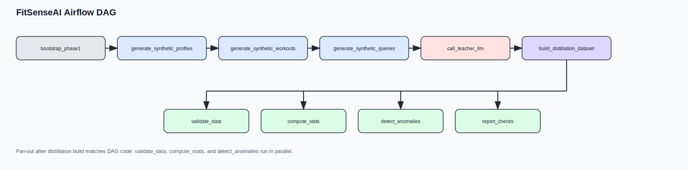
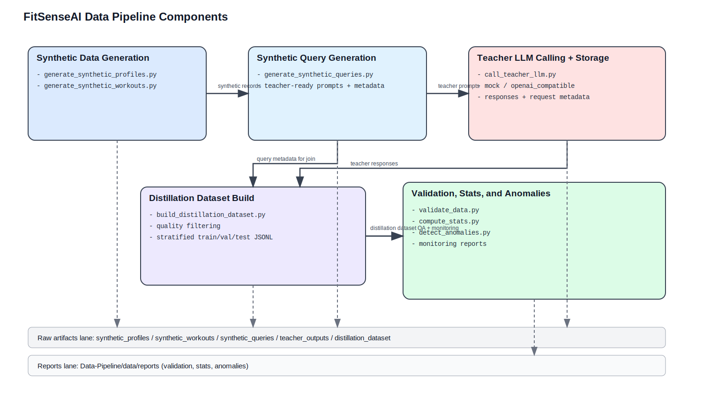
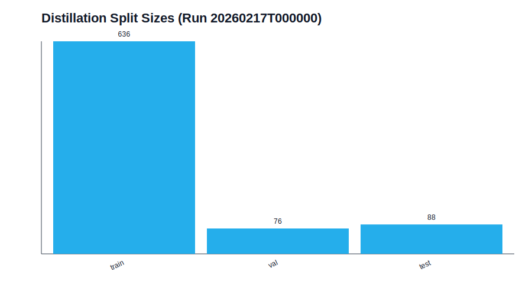
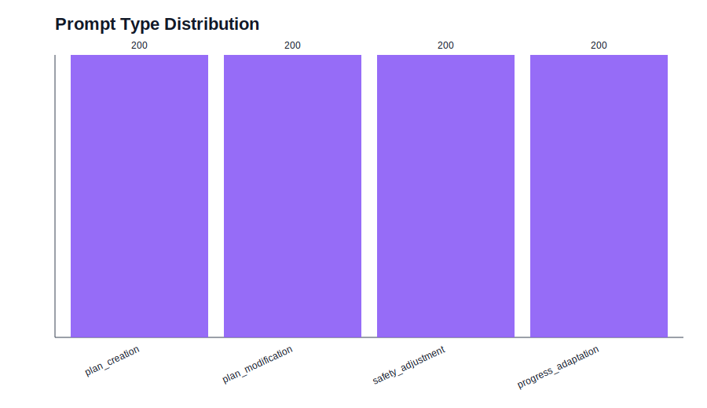
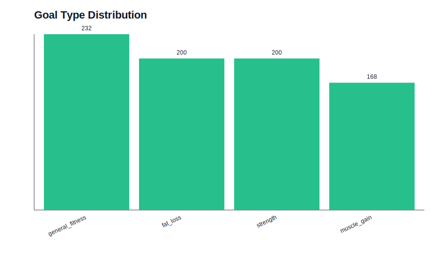
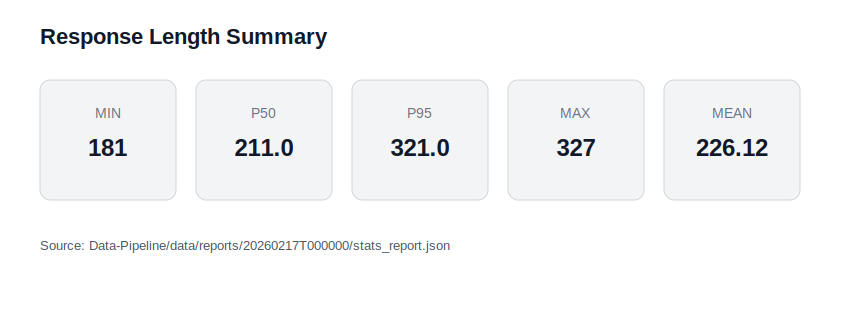
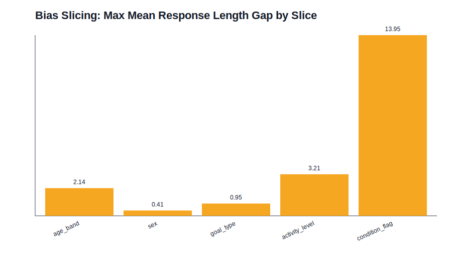

# FitSense AI Data Pipeline

This document describes the **actual implementation** in `Data-Pipeline/` for FitSenseAI.

## Outline

1. [Dataset Information](#1-dataset-information)
2. [Data Card](#2-data-card)
3. [Data Sources](#3-data-sources)
4. [Airflow Setup](#4-airflow-setup)
5. [Data Pipeline Components](#5-data-pipeline-components)
6. [Testing, Validation, and Monitoring](#6-testing-validation-and-monitoring)
7. [DVC, Reproducibility, and Folder Structure](#7-dvc-reproducibility-and-folder-structure)
8. [Appendix: Useful Commands](#80-appendix-useful-commands)

## 1. Dataset Information

This project uses a **synthetic-data-first pipeline** for the FitSenseAI use case (fitness coaching, workout planning, safety-aware adaptations, and teacher-student distillation).

This implementation intentionally does **not** use an external dataset. Instead, the pipeline generates:

- synthetic user profiles and medical context,
- synthetic workout plans and workout execution logs,
- synthetic health logs (calories, sleep, weight),
- synthetic natural-language user queries,
- teacher LLM responses,
- and a final distillation dataset for training a smaller model (e.g., Gemma).

### Current Run Snapshot (Airflow-tested run: `20260217T000000`)

- Distillation dataset size: **800 records**
- Split sizes: **train=636**, **val=76**, **test=88**
- Validation: **passed** (`valid=true`, `num_errors=0`)
- Anomaly detection: **no anomalies** (`severity=none`)
- Bias slicing: **no bias alert** (`bias_alert=false` under configured thresholds)

## 2. Data Card

This pipeline produces multiple datasets/artifacts across stages. The main training-ready dataset for the student model is the **distillation dataset** created in Phase 5.

### 2.1 Distillation Dataset (Primary Output)

- Location: `Data-Pipeline/data/raw/distillation_dataset/<run_id>/`
- Format: JSONL (`all_records.jsonl`, `train.jsonl`, `val.jsonl`, `test.jsonl`)
- Size (current tested run): **800 records**
- Role: supervised fine-tuning / instruction tuning dataset from teacher prompt-response pairs

### 2.2 Distillation Record Schema (Conceptual)

| Field         | Role        | Type   | Description                                                               |
| ------------- | ----------- | ------ | ------------------------------------------------------------------------- |
| `record_id`   | ID          | string | Stable deterministic UUID for a distillation example                      |
| `instruction` | Model Input | string | Teacher prompt text generated from synthetic user state                   |
| `context`     | Model Input | object | Prompt metadata (`prompt_type`, `slice_tags`, constraints, summary stats) |
| `response`    | Label       | string | Teacher LLM output (filtered)                                             |
| `metadata`    | Audit       | object | Provider/model/latency/attempts/source run ids                            |

### 2.3 Upstream Synthetic Data Artifacts

The pipeline also generates structured synthetic tables aligned to the FitSenseAI schema in `database/tables.sql`, including:

- `users`, `user_profiles`, `goals`, `user_goals`, `conditions`, `user_conditions`
- `user_medical_profiles`, `user_medications`, `user_allergies`
- `workout_plans`, `plan_exercises`, `plan_sets`
- `workouts`, `workout_exercises`, `workout_sets`
- `calorie_targets`, `calorie_intake_logs`, `sleep_targets`, `sleep_duration_logs`, `weight_logs`

## 3. Data Sources

### 3.1 Primary Data Source Strategy

No external dataset is used for this pipeline.

### 3.2 How data is acquired (for this project)

This implementation uses **reproducible synthetic generation** for data acquisition:

- `generate_synthetic_profiles.py`
- `generate_synthetic_workouts.py`
- `generate_synthetic_queries.py`

These scripts produce deterministic outputs using the configured seed in `Data-Pipeline/params.yaml`.

### 3.3 Teacher LLM data generation

Teacher outputs are generated via:

- `call_teacher_llm.py`

Supported providers:

- `mock` (deterministic, offline)
- `openai_compatible` (endpoint + API key env var)

The stored teacher outputs (prompt + response + metadata) become the source for the student distillation dataset.

## 4. Airflow Setup

We use Apache Airflow to orchestrate the full workflow as a DAG.

- DAG file: `Data-Pipeline/dags/fitsense_pipeline.py`
- DAG ID: `fitsense_pipeline`
- Operator style: `BashOperator` (new provider import path)
- Retry policy: 2 retries with 2-minute delay

### 4.1 Airflow DAG Diagram



### 4.2 Airflow Run (verified locally)

The DAG was tested locally using:

```bash
export AIRFLOW_HOME=$PWD/.airflow
export AIRFLOW__CORE__DAGS_FOLDER=$PWD/Data-Pipeline/dags
export FITSENSE_PYTHON_BIN=/Users/abhinav/miniconda3/envs/mlopsenv/bin/python
airflow db migrate
airflow dags test fitsense_pipeline 2026-02-17
```

Result: **DAG run completed successfully** and produced end-to-end artifacts for run id `20260217T000000`.

## 5. Data Pipeline Components

### 5.1 Pipeline Component Overview



The data pipeline is modularized from synthetic data generation through teacher inference, distillation dataset construction, and validation/monitoring. Each phase is implemented as a separate script and is orchestrated as an Airflow task.

### 5.2 Phase 1: Bootstrap / Scaffold

- `bootstrap_phase1.py`
- Validates config, logging, and reproducibility plumbing
- Writes `phase1_bootstrap.json`

### 5.3 Phase 2: Synthetic Data Generation

#### 5.3.1 Profiles and health context

- `generate_synthetic_profiles.py`
- Generates users, profiles, goals, conditions, medical profiles, medications, allergies, calorie targets, sleep targets

#### 5.3.2 Workouts and daily logs

- `generate_synthetic_workouts.py`
- Generates exercise catalog, workout plans, executed workouts/sets, calorie intake logs, sleep logs, and weight logs

Outputs are stored under:

- `Data-Pipeline/data/raw/synthetic_profiles/<run_id>/`
- `Data-Pipeline/data/raw/synthetic_workouts/<run_id>/`

### 5.4 Phase 3: Synthetic Query Generation

- `generate_synthetic_queries.py`
- Converts structured synthetic user state into teacher-ready prompts

Prompt types implemented:

- `plan_creation`
- `plan_modification`
- `safety_adjustment`
- `progress_adaptation`

Each query includes metadata required for downstream analysis:

- `user_id`, `scenario_id`, `prompt_type`
- `slice_tags` (`age_band`, `sex`, `goal_type`, `activity_level`, `condition_flag`)
- `expected_safety_constraints`
- `context_summary`

### 5.5 Phase 4: Teacher LLM Calling + Response Storage

- `call_teacher_llm.py`
- Reads latest synthetic queries
- Calls teacher model with retries/timeouts
- Stores request/response payloads and quality metadata

Stored fields include:

- request metadata (`query_id`, `scenario_id`, `prompt_type`)
- runtime metadata (`provider`, `model_name`, `attempt_count`, `latency_ms`, `status`)
- output fields (`response_text`, `raw_response`, `error`)
- post-checks (`safety_flags`, `post_validation`)

### 5.6 Phase 5: Distillation Dataset Builder

- `build_distillation_dataset.py`
- Filters teacher outputs by quality criteria
- Merges back query metadata
- Produces final supervised records for student-model fine-tuning
- Creates deterministic stratified train/val/test splits using `prompt_type|goal_type`

#### Distillation Split Visualization (current run)



### 5.7 Phase 6: Validation, Statistics, Anomaly Detection, Bias Slicing

Implemented modules:

- `validate_data.py`
- `compute_stats.py`
- `detect_anomalies.py`
- `bias_slicing.py`

Generated reports:

- `validation_report.json`
- `stats_report.json`
- `anomaly_report.json`
- `bias_report.json`

#### Prompt Type Distribution (current run)



#### Goal Type Distribution (current run)



#### Response Length Summary (current run)



#### Bias Slice Gap Summary (current run)



## 6. Testing, Validation, and Monitoring

Tests, schema/statistics generation, anomaly detection, and bias slicing are implemented in code and integrated into the pipeline.

### 6.1 Tests Implemented

Tests present in `Data-Pipeline/tests/` include:

- `test_reproducibility.py`
- `test_generate_synthetic_profiles.py`
- `test_generate_synthetic_workouts.py`
- `test_generate_synthetic_queries.py`
- `test_call_teacher_llm.py`
- `test_build_distillation_dataset.py`
- `test_phase6_modules.py`

These cover:

- reproducibility settings,
- schema/range checks for synthetic data,
- query metadata coverage,
- teacher call output contracts,
- distillation split integrity,
- and phase-6 report generation.

### 6.2 Logging and Error Handling

All scripts use shared utilities in `Data-Pipeline/scripts/common/`:

- `config.py`
- `logging_utils.py`
- `reproducibility.py`

This ensures:

- standardized logging format,
- deterministic seed application,
- centralized parameter loading,
- and consistent runtime behavior across tasks.

### 6.3 Anomaly Detection and Alerts

`detect_anomalies.py` checks for:

- duplicate records,
- missing responses,
- short/long responses,
- split imbalance vs. expected train/val/test ratios.

Current run (`20260217T000000`) result:

- `severity = none`
- no active alerts

### 6.4 Bias Slicing Analysis

`bias_slicing.py` analyzes response-length disparity across slices:

- `age_band`
- `sex`
- `goal_type`
- `activity_level`
- `condition_flag`

Current run result:

- `bias_alert = false` under configured threshold

## 7. DVC, Reproducibility, and Folder Structure

### 7.1 Folder Structure (actual implementation)

```txt
Data-Pipeline/
  dags/
    fitsense_pipeline.py
  data/
    raw/
      synthetic_profiles/
      synthetic_workouts/
      synthetic_queries/
      teacher_outputs/
      distillation_dataset/
    reports/
      phase6/
  logs/
  scripts/
    common/
    bootstrap_phase1.py
    generate_synthetic_profiles.py
    generate_synthetic_workouts.py
    generate_synthetic_queries.py
    call_teacher_llm.py
    build_distillation_dataset.py
    validate_data.py
    compute_stats.py
    detect_anomalies.py
    bias_slicing.py
  tests/
  dvc.yaml
  params.yaml
  requirements.txt
  README.md
```

### 7.2 DVC

A `dvc.yaml` scaffold is present in `Data-Pipeline/dvc.yaml`. The pipeline is already structured so artifact directories and stage outputs can be versioned with DVC.

### 7.3 Reproducibility

Reproducibility is enforced through:

- `reproducibility.seed` in `Data-Pipeline/params.yaml`
- `PYTHONHASHSEED`
- deterministic UUID generation patterns in scripts
- stable split logic in `build_distillation_dataset.py` (hash-based stratified assignment)

## 8.0 Appendix: Useful Commands

```bash
# Run end-to-end (script-by-script)
python Data-Pipeline/scripts/bootstrap_phase1.py
python Data-Pipeline/scripts/generate_synthetic_profiles.py
python Data-Pipeline/scripts/generate_synthetic_workouts.py
python Data-Pipeline/scripts/generate_synthetic_queries.py
python Data-Pipeline/scripts/call_teacher_llm.py
python Data-Pipeline/scripts/build_distillation_dataset.py
python Data-Pipeline/scripts/validate_data.py
python Data-Pipeline/scripts/compute_stats.py
python Data-Pipeline/scripts/detect_anomalies.py
python Data-Pipeline/scripts/bias_slicing.py

# Airflow local test
export AIRFLOW_HOME=$PWD/.airflow
export AIRFLOW__CORE__DAGS_FOLDER=$PWD/Data-Pipeline/dags
export FITSENSE_PYTHON_BIN=/Users/abhinav/miniconda3/envs/mlopsenv/bin/python
airflow dags test fitsense_pipeline 2026-02-17
```
