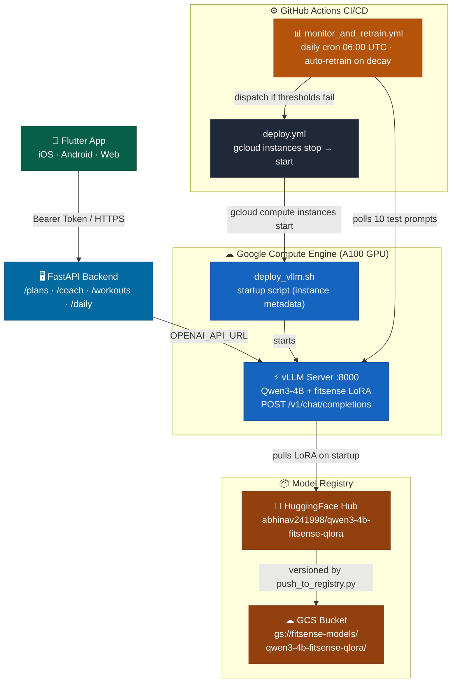
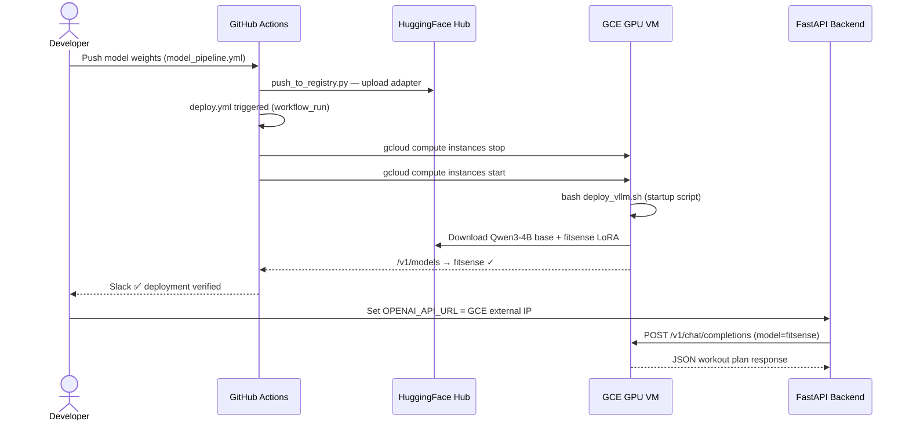
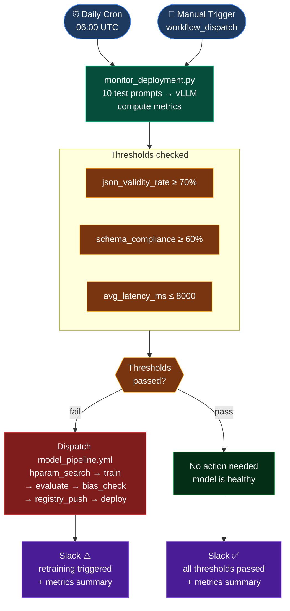

# FitSenseAI — Model Deployment

Deployment guide for the FitSenseAI student model (Qwen3-4B + QLoRA LoRA adapter) served via vLLM on Google Compute Engine, with automated CI/CD, monitoring, and retraining.

---

## Platform Choice

| Component | Platform | Why |
|---|---|---|
| Inference server | **Google Compute Engine** (GPU VM) | Cloud GPU for scalable inference |
| Serving framework | **vLLM** + LoRA adapter support | OpenAI-compatible API, production throughput |
| Backend API | FastAPI | Connects to vLLM via `/v1/chat/completions` |
| Model registry | HuggingFace Hub + GCS | `abhinav241998/qwen3-4b-fitsense-qlora` |
| CI/CD | GitHub Actions | Auto-deploy, daily monitoring, auto-retraining |

---

## Full System Architecture



---

## Deployment Flow



---

## Monitoring & Auto-Retraining



---

## Prerequisites

| Requirement | Detail |
|---|---|
| Google Cloud account | [console.cloud.google.com](https://console.cloud.google.com) with billing enabled |
| GPU quota | Request **NVIDIA A100** quota in your target region (e.g. `us-central1`) |
| VM image | `deeplearning-platform-release` — `pytorch-latest-gpu` family |
| Boot disk | **100 GB** minimum (Qwen3-4B weights ~8 GB + OS) |
| Firewall rule | Allow TCP 8000 from `0.0.0.0/0` (or your backend IP range) |
| `gcloud` CLI | Installed locally for setup steps |

---

## Step-by-Step: Deploy on Google Compute Engine

### Step 1 — Request GPU quota (if needed)

Go to **IAM & Admin → Quotas** in the GCP console, search for `NVIDIA_L4_GPUS` (or `NVIDIA_T4_GPUS`) in your region, and request an increase to 1. Quota increases are usually approved in minutes.

### Step 2 — Create the GCE GPU VM

```bash
# Set your project and preferred zone
PROJECT_ID="your-gcp-project-id"
ZONE="us-central1-a"
INSTANCE_NAME="fitsense-vllm-server"

gcloud compute instances create "${INSTANCE_NAME}" \
  --project="${PROJECT_ID}" \
  --zone="${ZONE}" \
  --machine-type="a2-highgpu-1g" \
  --accelerator="type=nvidia-tesla-a100,count=1" \
  --image-family="pytorch-latest-gpu" \
  --image-project="deeplearning-platform-release" \
  --boot-disk-size="100GB" \
  --boot-disk-type="pd-ssd" \
  --maintenance-policy="TERMINATE" \
  --metadata="install-nvidia-driver=True" \
  --scopes="cloud-platform"
```

> **GPU options:**
> - `a2-highgpu-1g` + `nvidia-tesla-a100` — 40 GB VRAM, **recommended minimum**
> - `a2-highgpu-2g` + `nvidia-tesla-a100` × 2 — for higher throughput
>
> T4 (16 GB) and L4 (24 GB) are insufficient for reliable serving of Qwen3-4B with LoRA and long context lengths.

### Step 3 — Open firewall port 8000

```bash
gcloud compute firewall-rules create allow-vllm \
  --project="${PROJECT_ID}" \
  --direction=INGRESS \
  --priority=1000 \
  --network=default \
  --action=ALLOW \
  --rules=tcp:8000 \
  --source-ranges=0.0.0.0/0 \
  --description="Allow vLLM inference traffic on port 8000"
```

### Step 4 — SSH into the VM

```bash
gcloud compute ssh "${INSTANCE_NAME}" \
  --project="${PROJECT_ID}" \
  --zone="${ZONE}"
```

### Step 5 — Upload and run the deployment script

```bash
# On your local machine — upload the script to the VM
gcloud compute scp Model-Deployment/deploy_vllm.sh \
  "${INSTANCE_NAME}":/opt/deploy_vllm.sh \
  --project="${PROJECT_ID}" --zone="${ZONE}"

# Back on the VM — run the server
bash /opt/deploy_vllm.sh
```

**What happens on first run (~5–10 minutes):**
1. Creates `/opt/fitsense/.venv` with `uv`
2. Installs `vllm` and `hf_transfer`
3. Downloads Qwen/Qwen3-4B base model (~8 GB) from HuggingFace
4. Downloads the fitsense LoRA adapter (~63 MB)
5. Starts the OpenAI-compatible server on port 8000

**What happens on subsequent runs (~30 seconds):**
- Reuses the existing `.venv` and cached model weights
- Server starts immediately

**Expected output when ready:**
```
INFO:     Started server process [...]
INFO:     Application startup complete.
INFO:     Uvicorn running on http://0.0.0.0:8000 (Press CTRL+C to quit)
```

### Step 6 — Register the script as the VM startup script

This enables CI/CD to redeploy by simply restarting the VM:

```bash
gcloud compute instances add-metadata "${INSTANCE_NAME}" \
  --project="${PROJECT_ID}" \
  --zone="${ZONE}" \
  --metadata-from-file startup-script=/opt/deploy_vllm.sh
```

### Step 7 — Find your VM's external IP

```bash
gcloud compute instances describe "${INSTANCE_NAME}" \
  --project="${PROJECT_ID}" \
  --zone="${ZONE}" \
  --format="get(networkInterfaces[0].accessConfigs[0].natIP)"
```

Save this IP — you will need it for the backend and monitoring.

### Step 8 — Verify the deployment

```bash
# Replace with your actual VM IP
VM_IP="34.XX.XX.XX"
API_KEY="$VLLM_API_KEY"

# List models — should include "fitsense"
curl "http://${VM_IP}:8000/v1/models" \
  -H "Authorization: Bearer ${API_KEY}"
```

Expected response:
```json
{"object":"list","data":[{"id":"fitsense","object":"model",...}]}
```

```bash
# Run a test inference (generates a workout plan)
curl "http://${VM_IP}:8000/v1/chat/completions" \
  -H "Authorization: Bearer ${API_KEY}" \
  -H "Content-Type: application/json" \
  -d '{
    "model": "fitsense",
    "messages": [
      {
        "role": "system",
        "content": "You are FitSense AI. Return only a JSON object with plan_name and days."
      },
      {
        "role": "user",
        "content": "Generate a workout plan.\n\n## My Profile\nAge: 28, Sex: M\nActivity level: moderately_active\nGoals: muscle_gain\nMedical conditions: none\nInjuries: none\n\nReturn a valid JSON object only."
      }
    ],
    "max_tokens": 2048,
    "temperature": 0.0
  }'
```

A successful response has `choices[0].message.content` containing a `<think>` block followed by a JSON workout plan.

### Step 9 — Configure and start the FastAPI backend

```bash
# On your local machine or any server
cd backend
cp .env.example .env.local

# Edit .env.local — set these values:
OPENAI_API_KEY=$VLLM_API_KEY
OPENAI_API_URL=http://<gce-external-ip>:8000/v1/chat/completions
OPENAI_MODEL=fitsense
MAX_OUTPUT_TOKENS=13000
DATABASE_ENGINE=sqlite
DATABASE_PATH=/absolute/path/to/fitsense.db

# Install and run
pip install -r requirements.txt
uvicorn app.main:app --reload --host 0.0.0.0 --port 8000
```

API docs available at `http://localhost:8000/docs`.

---

## Local Dev with Docker Compose

Runs the backend only (vLLM stays on GCE):

```bash
# Set your GCE VM external IP first
export VLLM_API_URL=http://<gce-external-ip>:8000
export VLLM_API_KEY=$VLLM_API_KEY

docker compose -f Model-Deployment/docker-compose.yml up --build
```

Backend at `http://localhost:8000/docs`.

> **Note**: Requires a `Dockerfile` in `backend/`. If it doesn't exist, use the `uvicorn` command in Step 9 instead.

---

## Run Monitoring Manually

```bash
# Against the live GCE endpoint
python Model-Deployment/scripts/monitor_deployment.py \
  --endpoint http://<gce-external-ip>:8000 \
  --api-key  $VLLM_API_KEY \
  --n-samples 20 \
  --baseline Model-Pipeline/outputs/evaluation/evaluation_results.json

# Dry run (no GPU / endpoint required — for testing the script itself)
python Model-Deployment/scripts/monitor_deployment.py \
  --endpoint http://localhost:8000 \
  --api-key  dummy \
  --dry-run
```

Reports are written to `Model-Deployment/reports/monitor_<timestamp>.json`.

---

## CI/CD GitHub Secrets Setup

Add these secrets in **GitHub → Settings → Secrets and variables → Actions**:

| Secret | How to get it | Used by |
|---|---|---|
| `GCP_SA_KEY` | GCP → IAM → Service Accounts → Create key (JSON) | `deploy.yml` |
| `GCP_PROJECT_ID` | Your GCP project ID | `deploy.yml` |
| `GCP_ZONE` | Zone where VM lives, e.g. `us-central1-a` | `deploy.yml` |
| `GCP_INSTANCE_NAME` | VM name, e.g. `fitsense-vllm-server` | `deploy.yml` |
| `VLLM_API_URL` | `http://<gce-external-ip>:8000` | `deploy.yml`, `monitor_and_retrain.yml` |
| `VLLM_API_KEY` | Value from `deploy_vllm.sh` | `deploy.yml`, `monitor_and_retrain.yml` |
| `GH_PAT` | GitHub → Settings → Developer settings → Tokens (scope: `workflow`) | `monitor_and_retrain.yml` |
| `SLACK_WEBHOOK_URL` | Slack → Your App → Incoming Webhooks (optional) | Both workflows |

**Service account permissions needed for `GCP_SA_KEY`:**
- `roles/compute.instanceAdmin.v1` — to stop/start the VM

---

## Retraining Thresholds

| Metric | Threshold | On breach |
|---|---|---|
| `json_validity_rate` | < 70% | Trigger retraining pipeline |
| `schema_compliance` | < 60% | Trigger retraining pipeline |
| Regression vs baseline | ≥ 10% drop in either | Trigger retraining pipeline |
| `avg_latency_ms` | > 8000 ms | Slack alert only — no retraining |
| Prompt length drift | > 25% shift vs val set | Logged in report — manual review |

---

## Directory Structure

```
Model-Deployment/
├── README.md                    ← This file
├── deploy_vllm.sh               ← vLLM server startup (runs as GCE startup script)
├── docker-compose.yml           ← Local dev stack (backend only)
├── scripts/
│   └── monitor_deployment.py   ← Monitoring + drift detection
└── reports/                     ← Auto-created — timestamped JSON reports

.github/workflows/
├── deploy.yml                   ← Auto-redeploy when new model is registered
└── monitor_and_retrain.yml      ← Daily monitoring + auto-retraining trigger
```

---

## Alternative: Manual Deployment on RunPod

> Use this only if Google Cloud GPU quota is unavailable. RunPod does **not** integrate with the CI/CD pipelines above — redeployment and monitoring must be triggered manually.

### Prerequisites

| Requirement | Detail |
|---|---|
| RunPod account | Sign up at [runpod.io](https://runpod.io) |
| GPU pod | **A100 (40 GB)** minimum — RTX 4090 (24 GB) or A40 (48 GB) also acceptable |
| Container image | `runpod/pytorch:2.4.0-py3.11-cuda12.4.1-devel-ubuntu22.04` |
| Exposed port | `8000 (HTTP)` |

### Steps

**1. Provision a RunPod GPU pod**

Go to [runpod.io](https://runpod.io) → **Deploy** → **GPU Cloud** → select RTX 4090 → set template image → under **Expose HTTP Ports** add `8000` → Deploy.

**2. Connect to the pod**

```bash
# Click "Connect" → "Start Web Terminal" in RunPod dashboard
# OR use SSH:
ssh root@<ssh-address> -p <port> -i ~/.ssh/id_rsa
```

**3. Install uv and run the deployment script**

```bash
pip install uv

# Download the script (from GitHub if public, or paste manually)
curl -O https://raw.githubusercontent.com/<your-repo>/main/Model-Deployment/deploy_vllm.sh

# Run — takes ~5-10 min on first boot
bash deploy_vllm.sh
```

The script uses `/workspace` as its working directory (RunPod default). Edit line `cd /workspace` → `cd /opt/fitsense` if preferred.

**4. Find your pod URL**

In the RunPod dashboard → your pod → **Connect** → **HTTP Service [Port 8000]**:

```
https://<pod-id>-8000.proxy.runpod.net
```

**5. Verify**

```bash
POD_URL="https://<pod-id>-8000.proxy.runpod.net"
API_KEY="$VLLM_API_KEY"

curl "${POD_URL}/v1/models" -H "Authorization: Bearer ${API_KEY}"
```

**6. Configure the backend**

Set `OPENAI_API_URL=https://<pod-id>-8000.proxy.runpod.net/v1/chat/completions` in your backend `.env.local` and start the FastAPI server as in Step 9 above.

**7. Run monitoring manually**

```bash
python Model-Deployment/scripts/monitor_deployment.py \
  --endpoint "https://<pod-id>-8000.proxy.runpod.net" \
  --api-key  "$VLLM_API_KEY" \
  --n-samples 10
```

Retraining must be triggered manually via the GitHub Actions UI when monitoring reports a failure.
