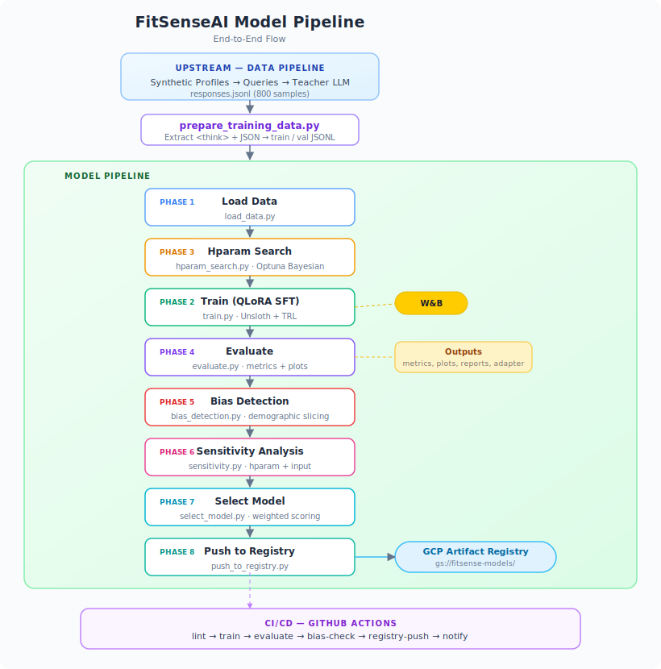
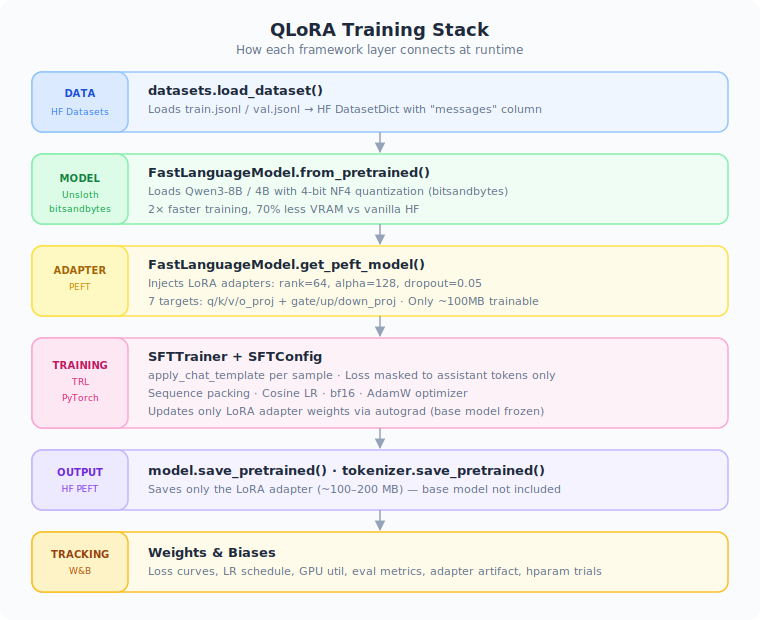
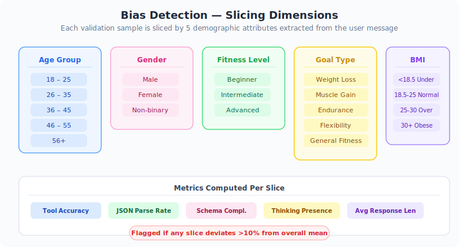
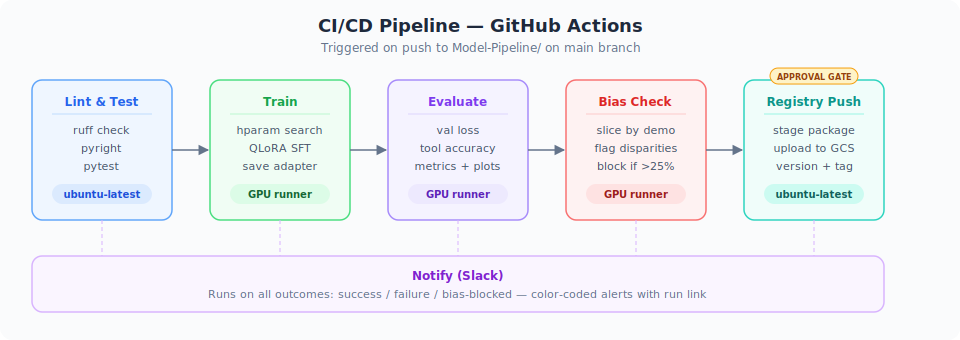

# Model Pipeline — QLoRA SFT with Thinking Distillation

Fine-tuning pipeline for FitSenseAI's student models (Qwen3-8B / Qwen3-4B) using knowledge distilled from a teacher model (Qwen3-32B). The technique is **QLoRA-based Supervised Fine-Tuning (SFT) with thinking distillation** — the student learns both the teacher's reasoning traces (`<think>` blocks) and final JSON tool-call outputs.

---

## Architecture Overview



## Training Data Format

Each sample in `train.jsonl` / `val.jsonl` is a 3-turn conversation:

```json
{
  "messages": [
    {
      "role": "system",
      "content": "You are a fitness coaching agent with access to tools..."
    },
    {
      "role": "user",
      "content": "I'm a 28-year-old male, intermediate, looking to build muscle..."
    },
    {
      "role": "assistant",
      "content": "<think>\nThe user wants a hypertrophy program...\n</think>\n{\"tool_name\": \"generate_workout_plan\", \"tool_input\": {...}}"
    }
  ],
  "metadata": {
    "response_id": "...",
    "provider": "groq",
    "has_reasoning": true
  }
}
```

**Dataset stats** (from `prepare_summary.json`):

| Split | Samples | Approx Tokens |
| ----- | ------- | ------------- |
| Train | 720     | ~3.0M         |
| Val   | 80      | ~330K         |

**Reasoning breakdown**: 181 Groq (with thinking) + 558 OpenRouter (with reasoning) + 61 OpenRouter (no reasoning) = 800 total

---

## Framework Stack



---

## Directory Structure

```
Model-Pipeline/
├── scripts/
│   ├── load_data.py            # Phase 1: Load & validate train/val JSONL
│   ├── train.py                # Phase 2: QLoRA SFT training loop
│   ├── hparam_search.py        # Phase 3: Bayesian hparam search (Optuna)
│   ├── evaluate.py             # Phase 4: Metrics & generation evaluation
│   ├── bias_detection.py       # Phase 5: Demographic bias analysis
│   ├── sensitivity.py          # Phase 6: Hparam & input sensitivity
│   ├── select_model.py         # Phase 7: Automated model selection
│   └── push_to_registry.py     # Phase 8: GCS upload & versioning
├── config/
│   └── training_config.yaml    # All hyperparameters & paths
├── data/
│   └── training/
│       ├── train.jsonl         # 720 training samples
│       ├── val.jsonl           # 80 validation samples
│       └── prepare_summary.json
├── prepare_training_data.py    # Converts raw teacher outputs → train/val JSONL
├── notebook.ipynb              # Exploratory notebook
├── Dockerfile                  # Multi-stage: training + inference images
├── requirements.txt            # Pinned Python dependencies
├── Plan.md                     # Implementation plan
└── README.md                   # This file
```

**Generated at runtime** (not committed):

```
Model-Pipeline/
└── outputs/
    ├── final_adapter/              # LoRA weights + tokenizer
    ├── training_summary.json       # Training run metadata
    ├── hparam_search/
    │   ├── best_hparams.json       # Winning hyperparameters
    │   └── all_trials.json         # All Optuna trial results
    ├── evaluation/
    │   ├── evaluation_results.json # Aggregate metrics
    │   ├── per_sample_results.jsonl
    │   └── plots/                  # Metric visualizations
    ├── bias_detection/
    │   ├── bias_report.json        # Flagged slices & recommendations
    │   └── plots/                  # Bias heatmaps
    ├── sensitivity/
    │   ├── sensitivity_report.json
    │   └── plots/
    ├── selection/
    │   └── selected_model.json     # Final model decision
    └── registry/
        └── {model_name}/{version}/ # Staged package for GCS
```

---

## Prerequisites

- **Python 3.11+** (via conda)
- **NVIDIA GPU** with CUDA 12.1+ (for training/evaluation)
- **Conda environment**: `mlopsenv`
- **Weights & Biases** account (for experiment tracking)
- **GCP credentials** (for registry push)

```bash
# Create and activate conda environment
conda create -n mlopsenv python=3.11 -y
conda activate mlopsenv

# Install dependencies
pip install -r Model-Pipeline/requirements.txt
```

### Environment Variables

| Variable                         | Purpose                               | Required For            |
| -------------------------------- | ------------------------------------- | ----------------------- |
| `WANDB_API_KEY`                  | Weights & Biases experiment tracking  | Training, hparam search |
| `GOOGLE_APPLICATION_CREDENTIALS` | GCP service account key path          | Registry push           |
| `GROQ_API_KEY`                   | Teacher LLM calls (upstream pipeline) | Data preparation only   |

---

## Pipeline Execution

### Quick Reference

```
 Phase 0   prepare_training_data.py    ── already done ──▶  train.jsonl + val.jsonl
 Phase 1   load_data.py                ── validate data  ──▶  HF Dataset
 Phase 3   hparam_search.py            ── Optuna search  ──▶  best_hparams.json
 Phase 2   train.py                    ── QLoRA SFT      ──▶  LoRA adapter
 Phase 4   evaluate.py                 ── metrics + gen   ──▶  evaluation_results.json
 Phase 5   bias_detection.py           ── slice analysis  ──▶  bias_report.json
 Phase 6   sensitivity.py              ── perturbation    ──▶  sensitivity_report.json
 Phase 7   select_model.py             ── compare models  ──▶  selected_model.json
 Phase 8   push_to_registry.py         ── GCS upload      ──▶  Artifact Registry
```

> **Note**: Always run from the repository root and with `conda activate mlopsenv`.

---

### Phase 0: Prepare Training Data (already complete)

Converts raw teacher LLM responses into the messages format for SFT.

```bash
python Model-Pipeline/prepare_training_data.py \
    --input  Data-Pipeline/data/raw/teacher-llm-responses/20260308T234052Z/responses.jsonl \
    --output Model-Pipeline/data/training \
    --val-ratio 0.1 \
    --seed 42
```

### Phase 1: Load & Validate Data

Loads the JSONL files, validates schema (3 messages per row, correct roles), and logs stats.

```bash
python Model-Pipeline/scripts/load_data.py \
    --train-path Model-Pipeline/data/training/train.jsonl \
    --val-path   Model-Pipeline/data/training/val.jsonl
```

This phase is also callable from other scripts:

```python
from load_data import load_and_validate
datasets = load_and_validate("Model-Pipeline/data/training/train.jsonl",
                              "Model-Pipeline/data/training/val.jsonl")
```

### Phase 2: Train (QLoRA SFT)

Trains a LoRA adapter on the 4-bit quantized base model.

```bash
# Train Qwen3-8B (default)
python Model-Pipeline/scripts/train.py \
    --config Model-Pipeline/config/training_config.yaml

# Train Qwen3-4B (override model)
python Model-Pipeline/scripts/train.py \
    --config Model-Pipeline/config/training_config.yaml \
    --model-name Qwen/Qwen3-4B \
    --output-dir Model-Pipeline/outputs/qwen3-4b
```

**Key training parameters** (from `training_config.yaml`):

| Parameter             | Value       | Notes                          |
| --------------------- | ----------- | ------------------------------ |
| LoRA rank             | 64          | Adapter dimension              |
| LoRA alpha            | 128         | Scaling factor (2x rank)       |
| Learning rate         | 2e-4        | With cosine decay              |
| Batch size            | 2           | Per device                     |
| Gradient accumulation | 8           | Effective batch = 16           |
| Epochs                | 3           | Full passes over training data |
| Sequence length       | 8192        | Max tokens per sample          |
| Quantization          | NF4 (4-bit) | Via bitsandbytes               |
| Packing               | Enabled     | Multiple samples per sequence  |

**Output**: `outputs/final_adapter/` (~100-200MB), `outputs/training_summary.json`

### Phase 3: Hyperparameter Search

Bayesian optimization with Optuna to find the best training configuration.

```bash
python Model-Pipeline/scripts/hparam_search.py \
    --config Model-Pipeline/config/training_config.yaml \
    --n-trials 10 \
    --output-dir Model-Pipeline/outputs/hparam_search
```

**Search space**:

| Hyperparameter  | Range             | Type        |
| --------------- | ----------------- | ----------- |
| `lora_r`        | [16, 32, 64]      | Categorical |
| `lora_alpha`    | 2 x `lora_r`      | Derived     |
| `learning_rate` | [1e-4, 5e-4]      | Log-uniform |
| `num_epochs`    | [2, 3, 5]         | Categorical |
| `batch_size`    | [1, 2, 4]         | Categorical |
| `lora_dropout`  | [0.0, 0.05, 0.1]  | Categorical |
| `warmup_ratio`  | [0.03, 0.05, 0.1] | Categorical |

Uses `TPESampler` (Tree-structured Parzen Estimator) with `MedianPruner` for early stopping of underperforming trials.

**Output**: `best_hparams.json`, `all_trials.json`

### Phase 4: Evaluation

Generates responses on the validation set and computes metrics.

```bash
python Model-Pipeline/scripts/evaluate.py \
    --adapter-dir Model-Pipeline/outputs/final_adapter \
    --config Model-Pipeline/config/training_config.yaml \
    --output-dir Model-Pipeline/outputs/evaluation \
    --max-samples 50  # optional: quick check
```

**Metrics computed**:

| Metric                 | What It Measures                             |
| ---------------------- | -------------------------------------------- |
| Validation Loss        | Cross-entropy on held-out set (forward pass) |
| Tool Call Accuracy     | Correct `tool_name` prediction rate          |
| JSON Parse Rate        | % of outputs that are valid JSON             |
| Schema Compliance      | % with `tool_name` + `tool_input` keys       |
| Thinking Presence Rate | % of responses with `<think>` block          |
| Avg Thinking Length    | Avg characters in reasoning traces           |
| Response Latency       | Avg ms per `model.generate()` call           |

Also computes per-tool accuracy breakdown and generates plots (bar charts, latency histogram).

**Output**: `evaluation_results.json`, `per_sample_results.jsonl`, `plots/`

### Phase 5: Bias Detection

Slices validation results by demographic attributes and flags disparities.

```bash
python Model-Pipeline/scripts/bias_detection.py \
    --adapter-dir Model-Pipeline/outputs/final_adapter \
    --config Model-Pipeline/config/training_config.yaml \
    --output-dir Model-Pipeline/outputs/bias_detection \
    --threshold 0.1
```

**Slicing dimensions** (extracted from user messages via regex):



Generates heatmap visualizations and mitigation recommendations.

**Output**: `bias_report.json`, `plots/bias_heatmap.png`

### Phase 6: Sensitivity Analysis

Analyzes how performance changes with hyperparameters and input perturbations.

```bash
python Model-Pipeline/scripts/sensitivity.py \
    --adapter-dir Model-Pipeline/outputs/final_adapter \
    --config Model-Pipeline/config/training_config.yaml \
    --trials-file Model-Pipeline/outputs/hparam_search/all_trials.json \
    --output-dir Model-Pipeline/outputs/sensitivity \
    --n-samples 50
```

**Two analysis types**:

1. **Hyperparameter sensitivity** — which hparams affect val loss the most (from Optuna trials)
2. **Input perturbation** — 4 tests:
   - Truncate user message to 50% / 25%
   - Remove system prompt entirely
   - Mask demographic info (age, gender, BMI, fitness level)

Use `--skip-hparam` or `--skip-input` to run only one type.

**Output**: `sensitivity_report.json`, hparam ranking plots, perturbation impact chart

### Phase 7: Model Selection

Compares two candidate models and selects the best one.

```bash
python Model-Pipeline/scripts/select_model.py \
    --eval-dirs  Model-Pipeline/outputs/eval-8b  Model-Pipeline/outputs/eval-4b \
    --bias-dirs  Model-Pipeline/outputs/bias-8b  Model-Pipeline/outputs/bias-4b \
    --output-dir Model-Pipeline/outputs/selection \
    --require-no-bias  # optional: block if bias detected
```

**Scoring weights**:

```
 Tool Call Accuracy ████████████████████████████████  0.30
 JSON Parse Rate    ████████████████████             0.20
 Schema Compliance  ███████████████                  0.15
 Val Loss (inv.)    ███████████████                  0.15
 Thinking Presence  ██████████                       0.10
 Bias Score (inv.)  ██████████                       0.10
```

**Output**: `selected_model.json` with scores, breakdown, rationale, and comparison table

### Phase 8: Push to Registry

Packages the adapter + metadata and uploads to GCS.

```bash
# Full upload
python Model-Pipeline/scripts/push_to_registry.py \
    --adapter-dir Model-Pipeline/outputs/final_adapter \
    --metadata-files \
        Model-Pipeline/outputs/hparam_search/best_hparams.json \
        Model-Pipeline/outputs/evaluation/evaluation_results.json \
        Model-Pipeline/outputs/bias_detection/bias_report.json \
        Model-Pipeline/outputs/training_summary.json \
    --gcs-bucket gs://fitsense-models \
    --model-name qwen3-8b-fitsense-qlora

# Dry run (local staging only, no GCS needed)
python Model-Pipeline/scripts/push_to_registry.py \
    --adapter-dir Model-Pipeline/outputs/final_adapter \
    --gcs-bucket gs://fitsense-models \
    --model-name qwen3-8b-fitsense-qlora \
    --dry-run

# Rollback to a previous version
python Model-Pipeline/scripts/push_to_registry.py \
    --gcs-bucket gs://fitsense-models \
    --model-name qwen3-8b-fitsense-qlora \
    --rollback-to v20260324T120000Z \
    --adapter-dir Model-Pipeline/outputs/final_adapter
```

**GCS layout**:

```
gs://fitsense-models/
└── qwen3-8b-fitsense-qlora/
    ├── latest.json                    # Points to current version
    ├── versions.json                  # Version history
    ├── v20260324T120000Z/
    │   ├── manifest.json
    │   ├── adapter_config.json
    │   ├── adapter_model.safetensors
    │   ├── tokenizer.json
    │   ├── best_hparams.json
    │   ├── evaluation_results.json
    │   └── bias_report.json
    └── v20260320T090000Z/             # Previous version
        └── ...
```

---

## CI/CD Pipeline

Automated via GitHub Actions (`.github/workflows/model_pipeline.yml`), triggered on push to `Model-Pipeline/`.



**Key features**:

- **Manual approval gate**: `registry-push` uses the `production` environment (requires reviewer approval)
- **Critical bias blocking**: Pipeline fails if any slice has >25% deviation
- **Slack notifications**: Success, failure, and blocked states with color coding
- **Workflow dispatch**: Manual trigger with model name override and skip-training option

**Required GitHub Secrets**:
| Secret | Purpose |
|--------|---------|
| `WANDB_API_KEY` | Experiment tracking |
| `GCP_SA_KEY` | GCP service account JSON |
| `SLACK_WEBHOOK_URL` | Pipeline notifications (optional) |

---

## Docker

Multi-stage build with two targets:

```bash
# Build training image (CUDA devel, full deps)
docker build --target training -t fitsense-train -f Model-Pipeline/Dockerfile .

# Build inference image (CUDA runtime, lightweight)
docker build --target inference -t fitsense-eval -f Model-Pipeline/Dockerfile .

# Run training (mount data + pass W&B key)
docker run --gpus all \
    -v $(pwd)/Data-Pipeline/data/raw:/app/Data-Pipeline/data/raw \
    -v $(pwd)/Model-Pipeline/data:/app/Model-Pipeline/data \
    -v $(pwd)/Model-Pipeline/outputs:/app/Model-Pipeline/outputs \
    -e WANDB_API_KEY=$WANDB_API_KEY \
    fitsense-train \
    --config Model-Pipeline/config/training_config.yaml

# Run evaluation
docker run --gpus all \
    -v $(pwd)/Model-Pipeline/outputs:/app/Model-Pipeline/outputs \
    -v $(pwd)/Model-Pipeline/data:/app/Model-Pipeline/data \
    fitsense-eval \
    --adapter-dir Model-Pipeline/outputs/final_adapter \
    --config Model-Pipeline/config/training_config.yaml
```

| Stage       | Base Image                               | Size | Purpose                                |
| ----------- | ---------------------------------------- | ---- | -------------------------------------- |
| `training`  | `nvidia/cuda:12.1.1-devel-ubuntu22.04`   | ~8GB | Full training with compilation support |
| `inference` | `nvidia/cuda:12.1.1-runtime-ubuntu22.04` | ~5GB | Evaluation and inference only          |

---

## Experiment Tracking

All training and search experiments are logged to **Weights & Biases** under the `fitsense-sft` project.

**What gets logged**:

- `train.py`: Loss curves, learning rate, GPU utilization, final adapter artifact
- `hparam_search.py`: Single summary run with all-trials table + best params
- Eval/bias results uploaded as artifacts alongside the adapter

Set your API key:

```bash
export WANDB_API_KEY=your_key_here
# or
wandb login
```

---

## Configuration Reference

All training parameters live in `config/training_config.yaml`:

```yaml
# Model
model_name: "Qwen/Qwen3-8B" # Base model from HuggingFace
max_seq_length: 8192 # Max tokens per sequence

# LoRA
lora_r: 64 # Adapter rank (higher = more capacity)
lora_alpha: 128 # Scaling factor (typically 2x rank)
lora_dropout: 0.05 # Regularization

# Training
batch_size: 2 # Per-device batch size
gradient_accumulation_steps: 8 # Effective batch = 16
num_epochs: 3 # Training epochs
learning_rate: 2e-4 # Peak learning rate
lr_scheduler_type: "cosine" # LR decay schedule
warmup_ratio: 0.05 # % of steps for warmup

# Tracking
report_to: "wandb" # "wandb", "mlflow", or "none"
wandb_project: "fitsense-sft" # W&B project name
```

Override any value via CLI: `--model-name Qwen/Qwen3-4B` or `--output-dir /custom/path`

---

## End-to-End Run (Full Pipeline)

```bash
# 0. Activate environment
conda activate mlopsenv

# 1. Validate data
python Model-Pipeline/scripts/load_data.py \
    --train-path Model-Pipeline/data/training/train.jsonl \
    --val-path   Model-Pipeline/data/training/val.jsonl

# 2. Hyperparameter search
python Model-Pipeline/scripts/hparam_search.py \
    --config Model-Pipeline/config/training_config.yaml \
    --n-trials 10

# 3. Train with best config (update training_config.yaml with best_hparams.json values)
python Model-Pipeline/scripts/train.py \
    --config Model-Pipeline/config/training_config.yaml

# 4. Evaluate
python Model-Pipeline/scripts/evaluate.py \
    --adapter-dir Model-Pipeline/outputs/final_adapter \
    --config Model-Pipeline/config/training_config.yaml

# 5. Bias detection
python Model-Pipeline/scripts/bias_detection.py \
    --adapter-dir Model-Pipeline/outputs/final_adapter \
    --config Model-Pipeline/config/training_config.yaml

# 6. Sensitivity analysis
python Model-Pipeline/scripts/sensitivity.py \
    --adapter-dir Model-Pipeline/outputs/final_adapter \
    --config Model-Pipeline/config/training_config.yaml \
    --trials-file Model-Pipeline/outputs/hparam_search/all_trials.json

# 7. Push to registry (after manual review)
python Model-Pipeline/scripts/push_to_registry.py \
    --adapter-dir Model-Pipeline/outputs/final_adapter \
    --gcs-bucket gs://fitsense-models \
    --model-name qwen3-8b-fitsense-qlora \
    --metadata-files \
        Model-Pipeline/outputs/hparam_search/best_hparams.json \
        Model-Pipeline/outputs/evaluation/evaluation_results.json \
        Model-Pipeline/outputs/bias_detection/bias_report.json
```
