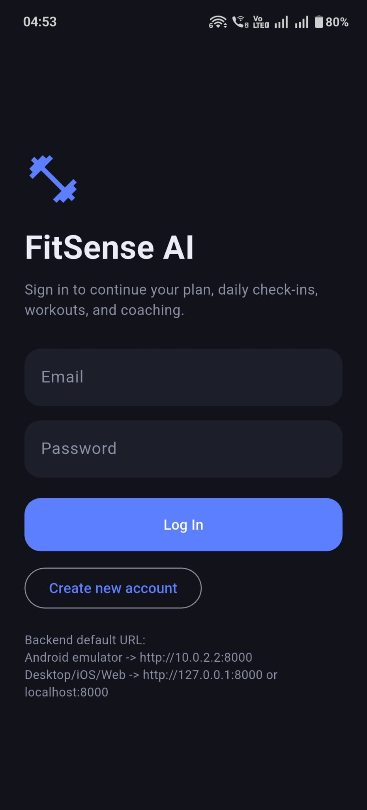
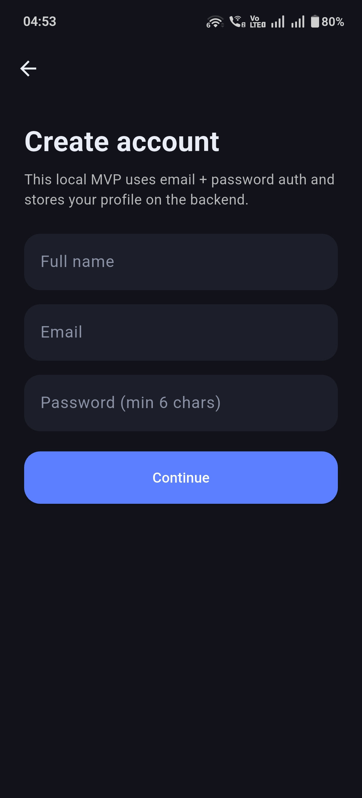
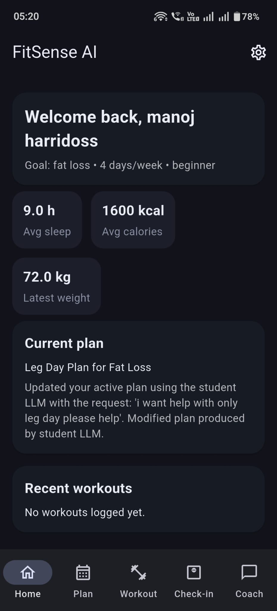
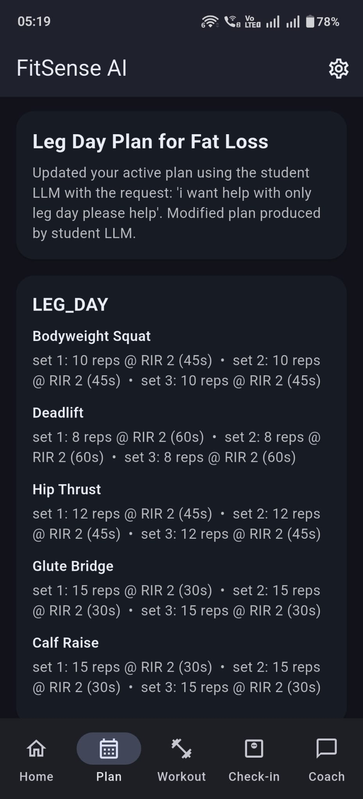
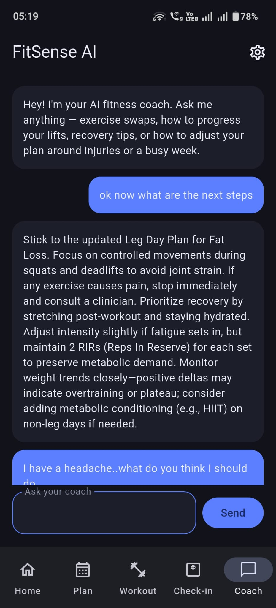
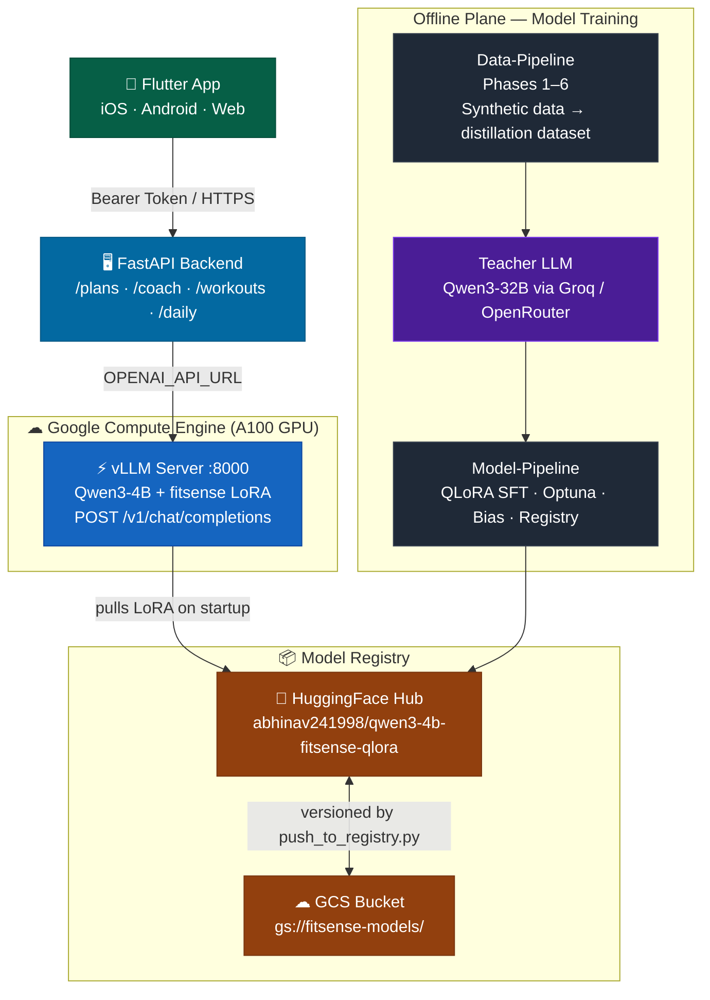
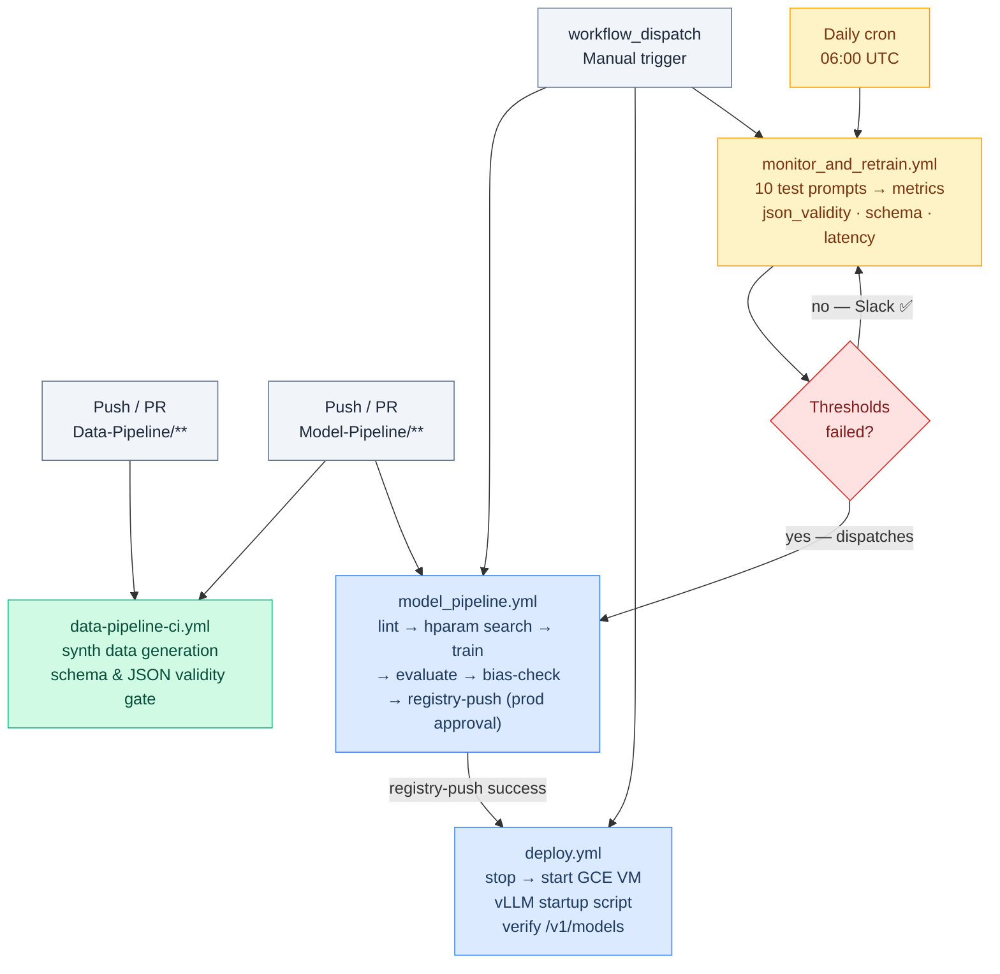

# FitSenseAI

AI-powered fitness coaching app — personalized workout plans, progress tracking, and health-aware guidance, built on a fine-tuned student model trained via teacher-student distillation.

[](https://fitsenseai.abhinavdev24.com/)
[](https://huggingface.co/abhinav241998/qwen3-4b-fitsense-qlora)
[](https://wandb.ai/abhinav241998-org/fitsense-sft/runs/zxo4igua)
[](https://dbdiagram.io/d/FitSenseAI-69850002bd82f5fce2cfe02c)
[](https://fitsense-backend.abhinavdev24.com/docs)
[](https://www.figma.com/design/H3Xs3MqvK6lrxt26g1LQfl/First-Designs?node-id=0-1&p=f)

---

## What is FitSenseAI

FitSense AI turns your goals, constraints, and weekly performance into a structured, adapting workout plan. A fine-tuned Qwen3-4B student model (distilled from a Qwen3-32B teacher) generates and evolves personalised plans, logs workouts, tracks health metrics, and answers coaching questions — all safety-aware and respecting medical conditions.

| Login                                                      | Sign Up                                                       | Dashboard                                                          | Workout Plan                                                       | AI Coach                                                      |
| ---------------------------------------------------------- | ------------------------------------------------------------- | ------------------------------------------------------------------ | ------------------------------------------------------------------ | ------------------------------------------------------------- |
|          |          |          |           |          |

---

## Full System Architecture



---

## Repository Map

| Directory | Description | Docs |
| --- | --- | --- |
| [`Data-Pipeline/`](Data-Pipeline/) | Synthetic data → distillation dataset · 6 phases · Airflow DAG | [README](Data-Pipeline/README.md) |
| [`Model-Pipeline/`](Model-Pipeline/) | QLoRA SFT · hparam search · evaluation · bias detection · GCS registry | [README](Model-Pipeline/README.md) |
| [`Model-Deployment/`](Model-Deployment/) | vLLM on GCE · monitoring · auto-retraining | [README](Model-Deployment/README.md) |
| [`backend/`](backend/) | FastAPI — auth, plans, coaching, workouts, daily logs | [README](backend/README.md) |
| [`mobile_app/`](mobile_app/) | Flutter iOS / Android / Web client | [README](mobile_app/README.md) |
| [`landing/`](landing/) | Next.js 14 marketing site · APK download | [README](landing/README.md) |
| [`database/`](database/) | MySQL / PostgreSQL schema (DBML source of truth) | [ER Diagram](https://dbdiagram.io/d/FitSenseAI-69850002bd82f5fce2cfe02c) |

---

## CI/CD Overview

Four GitHub Actions workflows cover the full MLOps lifecycle:



| Workflow | Trigger | Key gate |
| --- | --- | --- |
| `data-pipeline-ci.yml` | Push to `Data-Pipeline/**` | JSON validity ≥ 50% |
| `model_pipeline.yml` | Push to `Model-Pipeline/**` or manual | Bias deviation < 25%; prod approval for registry push |
| `deploy.yml` | Manual or after `model_pipeline` success | vLLM `/v1/models` returns `fitsense` |
| `monitor_and_retrain.yml` | Daily cron + manual | json_validity ≥ 70%, schema ≥ 60%, latency ≤ 8 s |

---

## Components

### Data Pipeline — [`Data-Pipeline/README.md`](Data-Pipeline/README.md)

- **6 phases**: bootstrap → synthetic profiles/workouts → query generation → teacher LLM → distillation dataset → validation & anomaly detection
- **800 records** (636 train / 76 val / 88 test) across 4 prompt types, fully reproducible via seed
- Orchestrated as an **Apache Airflow DAG** (`fitsense_pipeline`)
- Outputs: JSONL distillation dataset, validation/stats/anomaly JSON reports

### Model Pipeline — [`Model-Pipeline/README.md`](Model-Pipeline/README.md)

- **QLoRA SFT** of Qwen3-4B on 720 training samples distilled from Qwen3-32B teacher
- **Optuna** Bayesian hparam search (10 trials); best: `lora_r=8`, `lr=3.46e-4`, loss 0.3611
- Phases: load → hparam search → train → evaluate → bias detection (5 demographic dimensions) → sensitivity → model selection → push to GCS + HuggingFace
- [63 MB LoRA adapter](https://huggingface.co/abhinav241998/qwen3-4b-fitsense-qlora) · [W&B run](https://wandb.ai/abhinav241998-org/fitsense-sft/runs/zxo4igua)

### Model Deployment — [`Model-Deployment/README.md`](Model-Deployment/README.md)

- **vLLM** serving Qwen3-4B + fitsense LoRA on a **GCE A100 GPU VM** (OpenAI-compatible API)
- CI/CD: `deploy.yml` stops/starts the VM; startup script pulls the latest LoRA from HuggingFace
- Daily monitoring (`monitor_and_retrain.yml`) checks JSON validity, schema compliance, and latency; auto-triggers retraining on decay
- RunPod is supported as a fallback (manual only)

### Backend — [`backend/README.md`](backend/README.md)

- **FastAPI** with SQLAlchemy; supports MySQL (Cloud SQL) and SQLite
- Endpoints: `/auth`, `/plans`, `/workouts`, `/coach` (SSE streaming), `/daily`, `/targets`, `/dashboard`
- LLM inference priority: OpenAI-compatible API → Cloud Run → local LoRA adapter → rule-based fallback
- All LLM calls logged to `ai_interactions` table

### Mobile App — [`mobile_app/README.md`](mobile_app/README.md)

- **Flutter** client targeting iOS, Android, macOS, Windows, Linux, and Web
- Five tabs: Dashboard · Your Plan · Log Session · Daily Check-in · AI Coach
- Bearer-token auth via `shared_preferences`; SSE streaming for coach chat
- [Figma designs](https://www.figma.com/design/H3Xs3MqvK6lrxt26g1LQfl/First-Designs?node-id=0-1&p=f)

### Landing Page — [`landing/README.md`](landing/README.md)

- **Next.js 14** marketing site live at [fitsenseai.abhinavdev24.com](https://fitsenseai.abhinavdev24.com/)
- Serves the Android APK for direct download (`public/fitsense.apk`)
- Sections: Hero · App Screenshots · Video · Features · About · Personas · Meet the Team · CTA

---

## Quick Start

### Data Pipeline

```bash
conda activate mlopsenv
pip install -r Data-Pipeline/requirements.txt

python Data-Pipeline/scripts/bootstrap_phase1.py
python Data-Pipeline/scripts/generate_synthetic_profiles.py
python Data-Pipeline/scripts/generate_synthetic_workouts.py
python Data-Pipeline/scripts/generate_synthetic_queries.py
python Data-Pipeline/scripts/call_teacher_llm.py
python Data-Pipeline/scripts/build_distillation_dataset.py
python Data-Pipeline/scripts/validate_data.py
```

### Backend

```bash
cd backend
cp .env.example .env.local   # set DATABASE_ENGINE, OPENAI_API_KEY, OPENAI_API_URL
pip install -r requirements.txt
uvicorn app.main:app --reload --host 0.0.0.0 --port 8000
# API docs → http://localhost:8000/docs
```

### Mobile App

```bash
cd mobile_app
flutter pub get
flutter run -d ios        # or -d android / -d chrome / -d macos
```

### Landing Page

```bash
cd landing
npm install
npm run dev
# → http://localhost:3000
```

---

## Database

Schema source of truth: [`database/database_design.dbml`](database/database_design.dbml)

Live ER diagram: [dbdiagram.io/d/FitSenseAI](https://dbdiagram.io/d/FitSenseAI-69850002bd82f5fce2cfe02c)

SQL exports: [`database/mysql.sql`](database/mysql.sql) · [`database/postgresql.sql`](database/postgresql.sql)

Core areas: users & goals · health context (conditions, medications, allergies) · workout plans & execution logs · calorie / sleep / weight tracking · AI interaction logs.
