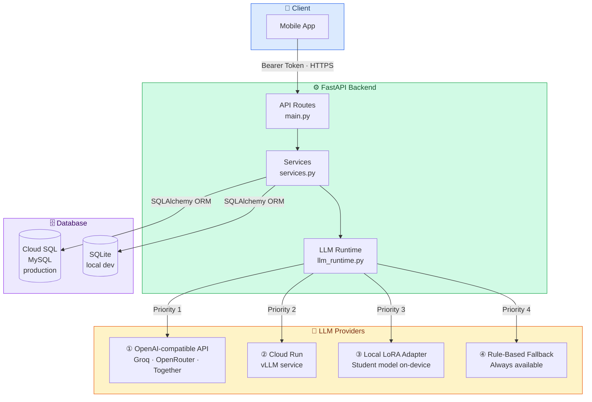
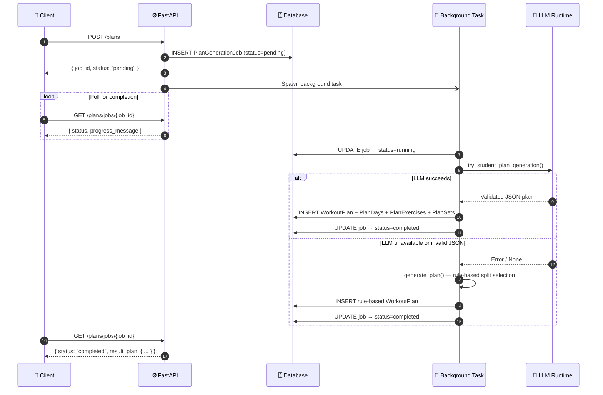
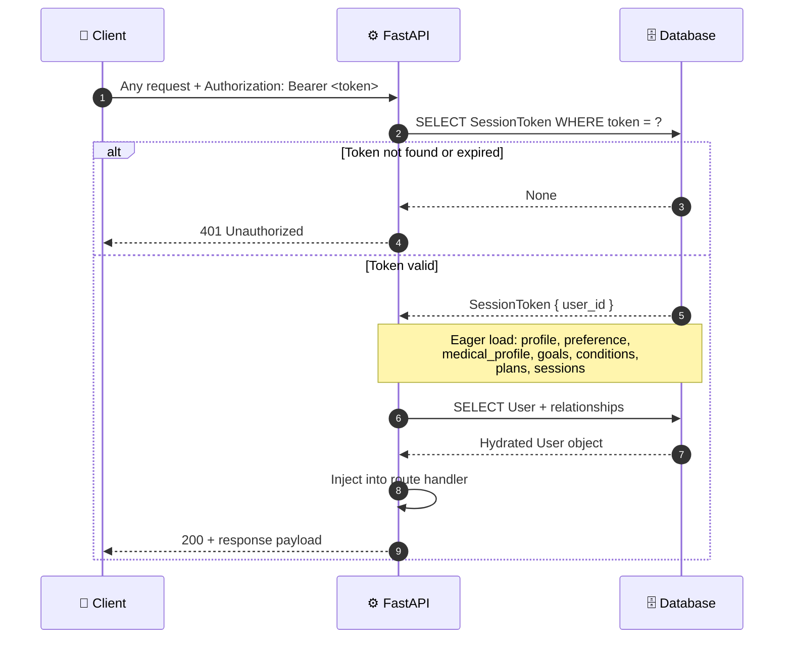
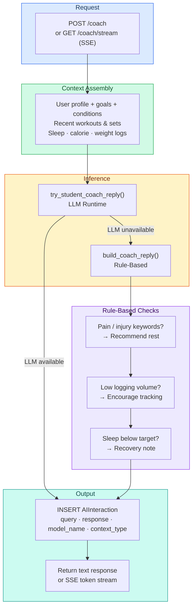

# FitSenseAI Backend

FastAPI backend for the FitSenseAI fitness coaching application.

[](https://fitsense-backend.abhinavdev24.com/docs)
[](https://dbdiagram.io/d/FitSenseAI-69850002bd82f5fce2cfe02c)

## Endpoints

### Auth & Profile

- `POST /auth/signup` — create account
- `POST /auth/login` — login, returns bearer token
- `GET /me` — current user profile
- `POST /profile/onboarding` — save onboarding data (age, sex, goals, equipment, medical info)

### Plans

- `POST /plans` — generate a new workout plan (async background job)
- `GET /plans/current` — get the active plan with all days/exercises/sets
- `POST /plans/{plan_id}:modify` — modify the active plan with a natural language instruction
- `GET /plans/jobs/{job_id}` — poll plan generation job status
- `GET /plans/jobs/latest` — latest pending job
- `POST /pipeline/trigger` — alias for plan generation

### Workouts

- `POST /workouts` — start a new workout session
- `POST /workouts/{id}/exercises` — log an exercise in a workout
- `POST /workouts/{id}/sets` — log a set
- `GET /workouts/recent` — recent workout summaries

### Daily Logs

- `POST /daily/sleep` — log sleep hours
- `POST /daily/calories` — log calorie intake
- `POST /daily/weight` — log body weight

### Targets

- `POST /targets/calories` — set a calorie target
- `GET /targets/calories` — list calorie targets
- `POST /targets/sleep` — set a sleep target
- `GET /targets/sleep` — list sleep targets

### Coaching

- `POST /coach` — ask the AI coach a question
- `GET /coach/stream` — SSE streaming version of coach
- `POST /adaptation:next_week` — get next-week training adaptation suggestions

### Other

- `GET /catalog/exercises` — list all exercises in the database
- `GET /model/runtime` — student LLM runtime status
- `GET /dashboard` — aggregated profile, plan, workouts, and logs

## Architecture

### System Overview



### Plan Generation Flow



### Request Authentication



### AI Coaching Flow



## Setup

```bash
cd backend
cp .env.example .env.local   # edit with your values
pip install -r requirements.txt
uvicorn app.main:app --reload --host 0.0.0.0 --port 8000
```

API docs at `http://127.0.0.1:8000/docs`.

## Database

Set `DATABASE_ENGINE` in `.env.local`. Supported: `mysql`, `sqlite`.

**MySQL (Cloud SQL):**

```env
DATABASE_ENGINE=mysql
DATABASE_USER=fitsensebackend
DATABASE_PASSWORD=your_password_here
DATABASE_NAME=fitsense
DATABASE_HOST=35.224.89.210
DATABASE_PORT=3306
```

**SQLite (local dev):**

```env
DATABASE_ENGINE=sqlite
DATABASE_PATH=/absolute/path/to/fitsense.db
```

Tables are created automatically on startup via `Base.metadata.create_all`.

Reset the database:

```bash
python scripts/reset_db.py
```

## LLM Inference

The backend uses an OpenAI-compatible chat completions API for plan generation and coaching. Configure in `.env.local`:

```env
OPENAI_API_KEY=your_api_key
OPENAI_API_URL=https://your-provider/v1/chat/completions
OPENAI_MODEL=your-model-id
MAX_OUTPUT_TOKENS=13000
```

Any provider exposing a `/v1/chat/completions` endpoint works (Groq, Together AI, Ollama, LM Studio, etc).

If no API is configured, the backend falls back to rule-based plan generation and coaching.

### Inference priority

1. **OpenAI-compatible API** — if `OPENAI_API_KEY` and `OPENAI_API_URL` are set
2. **Cloud Run** — if `FITSENSE_CLOUDRUN_URL` is set (deployed vLLM service)
3. **Local model** — if a trained LoRA adapter is discovered and inference dependencies are installed
4. **Rule-based fallback** — always available

### Student model auto-discovery

The backend scans `Model-Pipeline/adapters/` for trained LoRA adapters. If found (and optional deps installed), it uses the student model directly.

Accepted layouts:

- **LoRA adapter**: `adapter_config.json` + `adapter_model.safetensors`
- **Full merged model**: `config.json` + model weights
- **Artifact package**: set `FITSENSE_STUDENT_ARTIFACT` to a local `.zip`/`.tar.gz` or directory

Optional env vars:

- `FITSENSE_STUDENT_ADAPTER_PATH` — explicit adapter directory
- `FITSENSE_STUDENT_BASE_MODEL` — override base model name
- `FITSENSE_STUDENT_REGISTRY_RECORD` — explicit registry record JSON

Install optional model-serving dependencies:

```bash
pip install -r requirements-llm.txt
```

### Runtime check

```
GET /model/runtime
```

Returns whether the student LLM is available, the base model, adapter path, and provider details.

## AI Interaction Logging

All LLM calls are logged to the `ai_interactions` table with:

- `context_type`: route that triggered the call (`coach`, `coach-stream`, `plan-generate`, `plan-modify`, or `failed`)
- `query_text`: full user prompt sent to the LLM
- `response_text`: full raw LLM response
- `model_name`: model used for inference

Failed LLM calls are logged with `context_type="failed"` and the error in `response_text`.

## Debugging

- `GET /model/runtime` — shows whether the student adapter is runnable
- `POST /coach` response includes `execution_debug` with selected backend and fallback reason
- `GET /coach/stream` sends an initial SSE event with `debug` before token deltas
- Plan jobs include progress text indicating whether the student model or rules were used
- Set `FITSENSE_DEBUG_VERTEX=1` in `.env.local` for verbose inference logging
