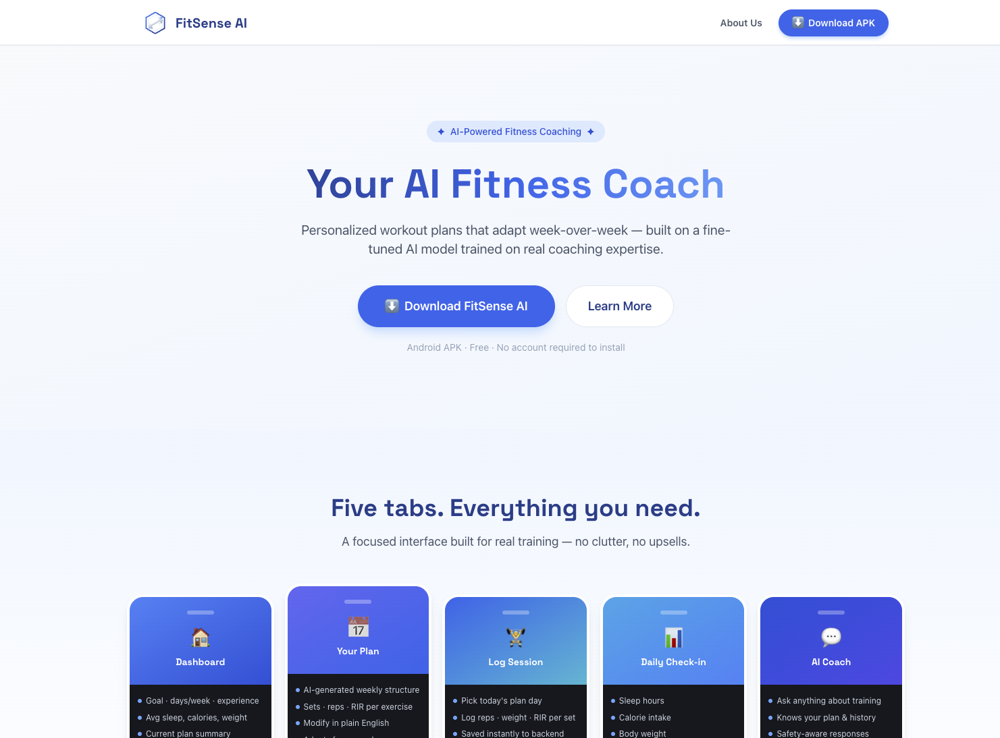
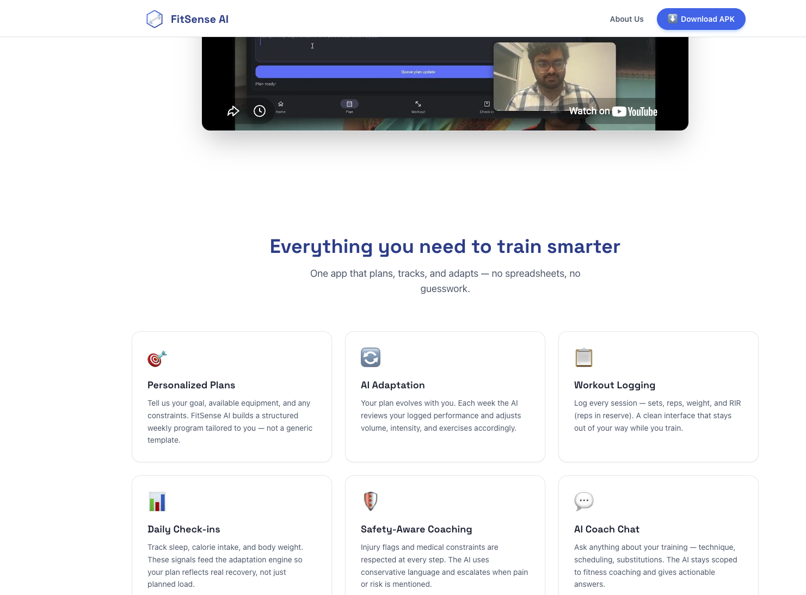
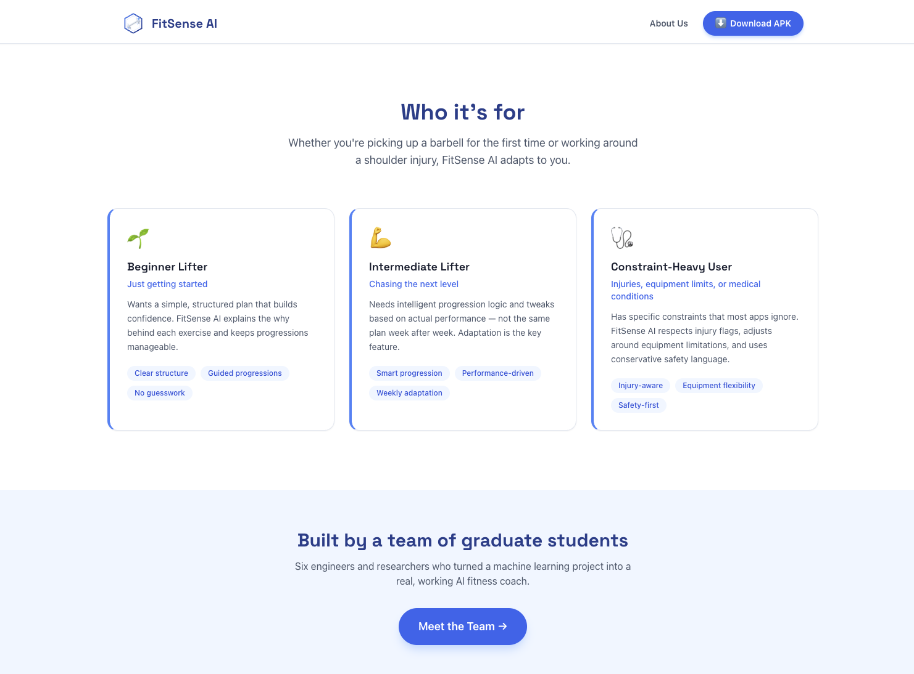
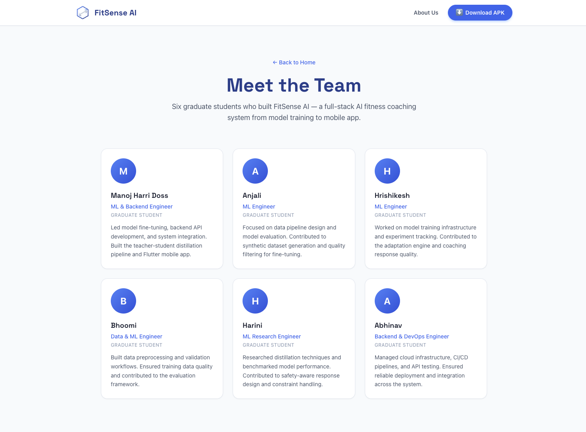
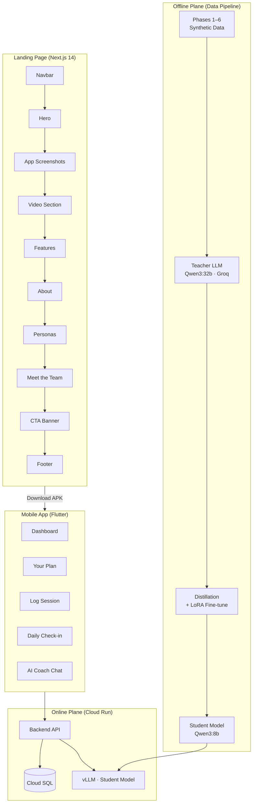
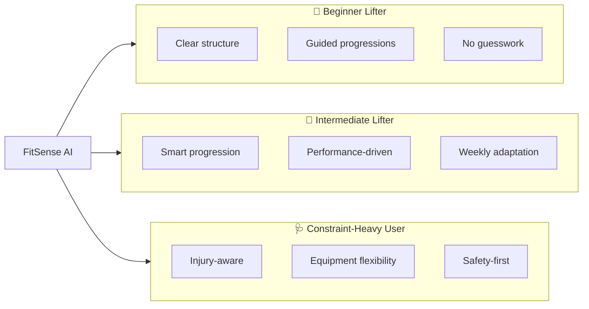

# FitSense AI — Landing Page

> Next.js 14 marketing site for FitSense AI, an AI-powered fitness coaching app built on a fine-tuned student model trained via teacher-student distillation.

[](https://fitsenseai.abhinavdev24.com/)

|                Preview                |                     Preview                     |
| :-----------------------------------: | :---------------------------------------------: |
|          |            |
|  |  |

---

## Overview

FitSense AI turns your goals, constraints, and weekly performance into a structured, adapting workout plan. The landing page communicates what the app does, how the AI works, and who it's for — and serves the Android APK for direct download.

---

## Architecture

### System Architecture



## App Screens

FitSense AI is a five-tab Flutter application:

| Tab                | Purpose                                                           |
| ------------------ | ----------------------------------------------------------------- |
| **Dashboard**      | Goal summary, avg sleep/calories/weight, recent workouts          |
| **Your Plan**      | AI-generated weekly structure with sets · reps · RIR per exercise |
| **Log Session**    | Per-set logging of reps, weight, RIR — feeds next-week adaptation |
| **Daily Check-in** | Sleep hours, calorie intake, body weight signals                  |
| **AI Coach**       | Conversational coach scoped to fitness, safety-aware              |

---

## Features

| Feature                   | Description                                                                       |
| ------------------------- | --------------------------------------------------------------------------------- |
| **Personalized Plans**    | Structured weekly program tailored to your goal, equipment, and constraints       |
| **AI Adaptation**         | Plan evolves each week based on logged performance — volume, intensity, exercises |
| **Workout Logging**       | Sets · reps · weight · RIR with a clean, distraction-free interface               |
| **Daily Check-ins**       | Sleep, calories, and body weight feed the adaptation engine                       |
| **Safety-Aware Coaching** | Injury flags and medical constraints respected at every step; escalates on risk   |
| **AI Coach Chat**         | Ask anything about training — technique, scheduling, substitutions                |

---

## Who It's For



## Getting Started (Local Dev)

```bash
cd landing
npm install
npm run dev
# → http://localhost:3000
```

### Build & Export

```bash
npm run build
```

### Project Structure

```
landing/
├── src/
│   ├── app/
│   │   ├── page.tsx          # Home (all sections)
│   │   ├── about/page.tsx    # Meet the Team route
│   │   ├── layout.tsx
│   │   └── globals.css
│   └── components/
│       ├── Navbar.tsx
│       ├── Hero.tsx
│       ├── AppScreenshots.tsx
│       ├── VideoSection.tsx
│       ├── Features.tsx
│       ├── About.tsx
│       ├── Personas.tsx
│       ├── MeetTeam.tsx
│       ├── CTABanner.tsx
│       └── Footer.tsx
├── public/
│   ├── logo.svg
│   └── fitsense.apk          # Android APK served for download
├── screenshots/
│   ├── hero.png
│   ├── features.png
│   ├── personas.png
│   └── meet-the-team.png
├── next.config.mjs
├── tailwind.config.ts
└── package.json
```
