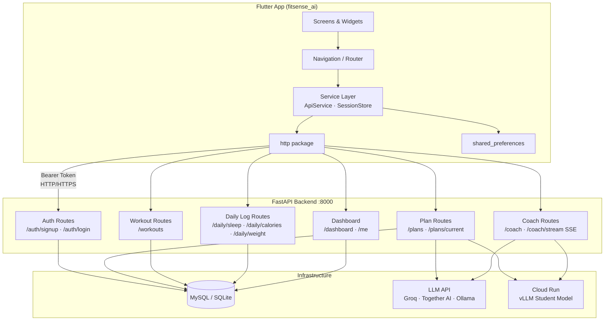
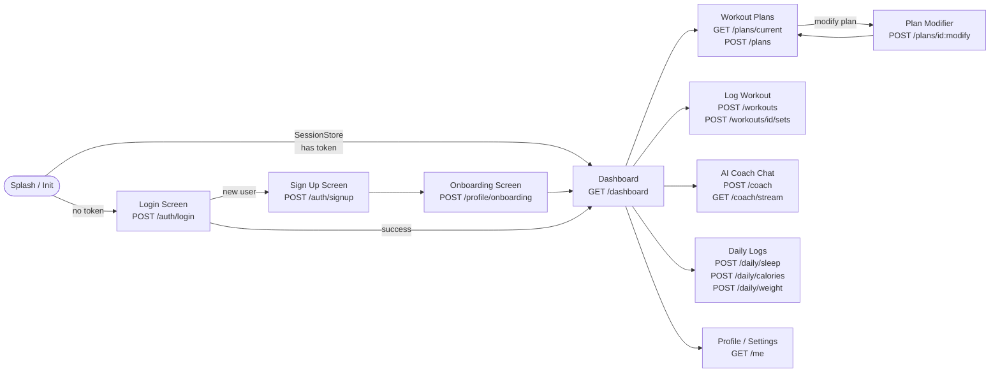
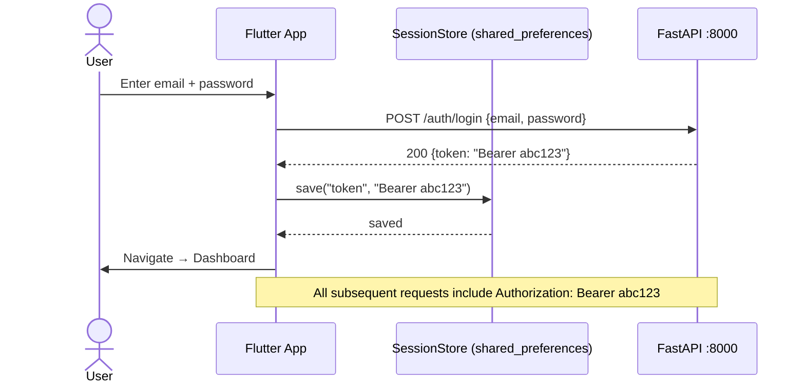
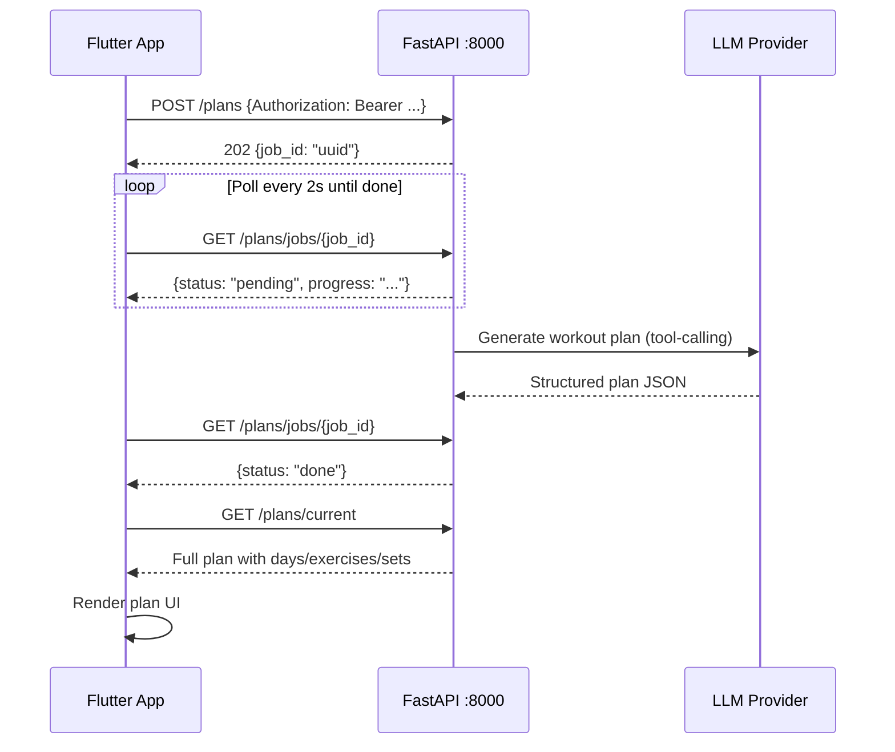
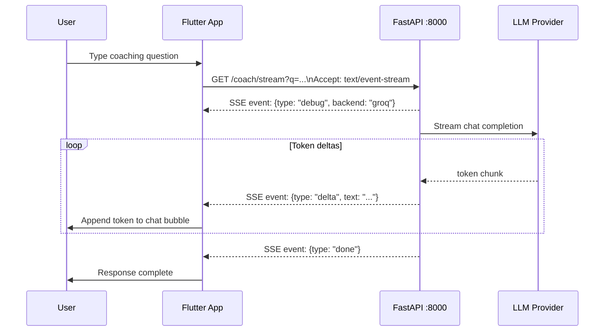
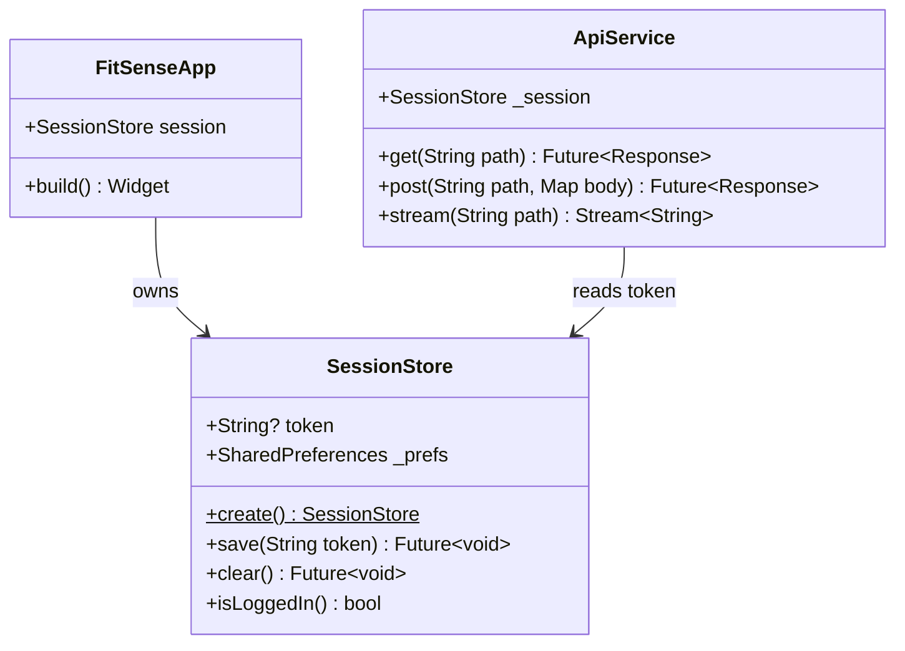

# FitSenseAI Mobile App

Flutter client for the FitSenseAI fitness coaching platform. Connects to the FastAPI backend to deliver personalized workout plans, AI coaching, workout logging, and health tracking across iOS, Android, and desktop.

- **Package**: `fitsense_ai`
- **Version**: `1.0.0+1`
- **Dart SDK**: `>=3.3.0 <4.0.0`
- **Status**: Scaffolded — `lib/` implementation in progress

---

## Screenshots

### [🎨 Figma Designs — First Designs](https://www.figma.com/design/H3Xs3MqvK6lrxt26g1LQfl/First-Designs?node-id=0-1&p=f)

| Login | Sign Up | Dashboard | Workout Plan | AI Coach |
|---|---|---|---|---|
|  |  |  |  |  |

---

## Supported Platforms

| Platform | Folder |
|---|---|
| iOS | `ios/` |
| Android | `android/` |
| macOS | `macos/` |
| Windows | `windows/` |
| Linux | `linux/` |
| Web | `web/` |

---

## Tech Stack

| Layer | Package | Version |
|---|---|---|
| UI framework | `flutter` (SDK) | 3.x |
| HTTP client | `http` | `^1.2.1` |
| Session storage | `shared_preferences` | `^2.2.3` |
| iOS icons | `cupertino_icons` | `^1.0.8` |
| Testing | `flutter_test` (SDK) | — |
| Linting | `flutter_lints` | `^5.0.0` |

---

## Architecture



---

## Screen Navigation Flow



---

## Network & API Flow

### Auth Flow



### Plan Generation (Async Job)



### AI Coach (SSE Streaming)



---

## Session Management



The bearer token returned by `/auth/login` or `/auth/signup` is written to `shared_preferences` via `SessionStore` and attached as the `Authorization` header on every subsequent request. On app cold start, `SessionStore.create()` reads the persisted token — if present the app goes straight to Dashboard, otherwise to Login.

---

## Planned `lib/` Structure

```
lib/
├── main.dart                  # Entry point — creates SessionStore, runs FitSenseApp
├── app.dart                   # FitSenseApp widget (MaterialApp + router)
├── services/
│   ├── session_store.dart     # SharedPreferences-backed token store
│   └── api_service.dart       # HTTP wrapper (get/post/stream), attaches Bearer token
├── models/
│   ├── plan.dart              # WorkoutPlan, Day, Exercise, Set
│   ├── workout.dart           # WorkoutSession, LoggedSet
│   └── daily_log.dart         # SleepLog, CalorieLog, WeightLog
└── screens/
    ├── login_screen.dart
    ├── signup_screen.dart
    ├── onboarding_screen.dart
    ├── dashboard_screen.dart
    ├── plans_screen.dart
    ├── workout_screen.dart
    ├── coach_screen.dart
    └── logs_screen.dart
```

---

## API Integration Reference

All requests require `Authorization: Bearer <token>` unless noted.

### Auth & Profile

| Method | Path | Description |
|---|---|---|
| `POST` | `/auth/signup` | Create account (no auth required) |
| `POST` | `/auth/login` | Login, returns bearer token (no auth required) |
| `GET` | `/me` | Current user profile |
| `POST` | `/profile/onboarding` | Save onboarding data (age, goals, equipment, medical) |

### Plans

| Method | Path | Description |
|---|---|---|
| `POST` | `/plans` | Generate a new workout plan (async background job) |
| `GET` | `/plans/current` | Active plan with all days / exercises / sets |
| `POST` | `/plans/{plan_id}:modify` | Modify plan with a natural language instruction |
| `GET` | `/plans/jobs/{job_id}` | Poll plan generation job status |
| `GET` | `/plans/jobs/latest` | Latest pending job |

### Workouts

| Method | Path | Description |
|---|---|---|
| `POST` | `/workouts` | Start a new workout session |
| `POST` | `/workouts/{id}/exercises` | Log an exercise in a workout |
| `POST` | `/workouts/{id}/sets` | Log a set |
| `GET` | `/workouts/recent` | Recent workout summaries |

### Daily Logs

| Method | Path | Description |
|---|---|---|
| `POST` | `/daily/sleep` | Log sleep hours |
| `POST` | `/daily/calories` | Log calorie intake |
| `POST` | `/daily/weight` | Log body weight |

### Targets

| Method | Path | Description |
|---|---|---|
| `POST` | `/targets/calories` | Set a calorie target |
| `GET` | `/targets/calories` | List calorie targets |
| `POST` | `/targets/sleep` | Set a sleep target |
| `GET` | `/targets/sleep` | List sleep targets |

### Coaching

| Method | Path | Description |
|---|---|---|
| `POST` | `/coach` | Ask the AI coach (returns full response) |
| `GET` | `/coach/stream` | SSE streaming version of coach |
| `POST` | `/adaptation:next_week` | Next-week training adaptation suggestions |

### Other

| Method | Path | Description |
|---|---|---|
| `GET` | `/catalog/exercises` | All exercises in the database |
| `GET` | `/dashboard` | Aggregated profile, plan, workouts, and logs |
| `GET` | `/model/runtime` | Student LLM runtime status |

---

## Setup

### Prerequisites

- [Flutter SDK](https://docs.flutter.dev/get-started/install) (Dart `>=3.3.0`)
- Xcode (iOS / macOS targets)
- Android Studio + Android SDK (Android target)
- Backend running at `http://localhost:8000` (see [backend/README.md](../backend/README.md))

### Install dependencies

```bash
cd mobile_app
flutter pub get
```

### Configure backend URL

Set the base URL for the backend API in your environment or a config file before running. Default target: `http://localhost:8000`.

### Run

```bash
# iOS simulator
flutter run -d ios

# Android emulator
flutter run -d android

# macOS desktop
flutter run -d macos

# Chrome (web)
flutter run -d chrome

# Windows desktop
flutter run -d windows

# Linux desktop
flutter run -d linux
```

### Build release

```bash
# iOS
flutter build ios --release

# Android APK
flutter build apk --release

# Android App Bundle
flutter build appbundle --release

# macOS
flutter build macos --release

# Web
flutter build web --release
```

---

## Testing

```bash
flutter test
```

The test in `test/widget_test.dart` verifies that the app renders the login screen when no session token is stored:

```dart
testWidgets('app renders login when no session exists', (tester) async {
  SharedPreferences.setMockInitialValues({});
  final session = await SessionStore.create();
  await tester.pumpWidget(FitSenseApp(session: session));
  expect(find.text('FitSense AI'), findsOneWidget);
});
```
